# Entity Relationship Diagram (ERD) - Master Version

This ERD encompasses all system entities: foundational booking logic (Waitlists, Durations), the Aggregator logic (B2B, Packages, QR Check-ins, Payouts), Workspace Sections (Desks, Meeting Rooms, Theaters), Notifications & OTP, Amenities Management, and the Loyalty Points & Rules System.

> **Total Entities: 20 | Total Relationships: 24**

```mermaid
erDiagram

    %% ===== CORE ENTITIES =====

    USERS {
        uuid id PK
        string name
        string email
        string password_hash
        enum role "GUEST, B2C, HR_ADMIN, PARTNER_ADMIN, SUPER_ADMIN"
        uuid company_id FK "Nullable - links to COMPANIES if B2B employee"
        boolean email_verified "default false"
    }

    COMPANIES {
        uuid id PK
        string company_name
        uuid hr_admin_id FK
        int total_passes_allocated "Legacy: passes"
        float shared_wallet_balance "New: For Shared Wallet feature"
    }

    PARTNERS {
        uuid id PK
        string brand_name
        string contact_email
        string tax_number
        float revenue_share_percentage
    }

    %% ===== WORKSPACE & SECTIONS =====

    WORKSPACES {
        uuid id PK
        uuid partner_id FK
        string name
        string city
        string location_map_url
        float daily_rate "Reference desk daily rate"
        float monthly_rate "Reference desk monthly rate"
        float yearly_rate "Reference desk yearly rate"
        float pass_visit_value "Value compensated to partner per QR check-in"
        int total_capacity
    }

    WORKSPACE_SECTIONS {
        uuid id PK
        uuid workspace_id FK
        enum type "DESK, MEETING_ROOM, THEATER"
        string name "e.g. Open Desks Area, Meeting Room 1, Main Theater"
        int capacity
        float daily_rate "Nullable - for DESK only"
        float monthly_rate "Nullable - for DESK only"
        float yearly_rate "Nullable - for DESK only"
    }

    HOURLY_PACKAGES {
        uuid id PK
        uuid section_id FK "Links to MEETING_ROOM or THEATER section"
        string package_name "e.g. 2 Hours Per Day or 8 Hours Per Month"
        int hours_amount
        enum period_type "PER_DAY, PER_MONTH"
        float price
    }

    %% ===== AMENITIES MANAGEMENT =====

    AMENITIES_CATALOG {
        uuid id PK
        string name "e.g. Fast Wi-Fi, Coffee, Cleaning Service"
        string icon "Icon identifier for UI"
        boolean is_default "true = platform default - false = partner suggested"
        enum status "APPROVED, PENDING_APPROVAL, REJECTED"
        uuid requested_by FK "Nullable - null for platform defaults - FK to USERS"
        datetime created_at
    }

    WORKSPACE_AMENITIES {
        uuid id PK
        uuid workspace_id FK
        uuid amenity_id FK "Links to AMENITIES_CATALOG"
    }

    %% ===== PLANS & SUBSCRIPTIONS =====

    MEMBERSHIP_PLANS {
        uuid id PK
        string plan_name
        enum type "B2C, B2B"
        int total_visits_allowed
        float price
    }

    SUBSCRIPTIONS {
        uuid id PK
        uuid user_id FK
        uuid plan_id FK
        date start_date
        date end_date
        int visits_used
        enum status "ACTIVE, EXPIRED, CANCELLED"
    }

    %% ===== BOOKINGS =====

    DIRECT_BOOKINGS {
        uuid id PK
        uuid user_id FK
        uuid workspace_id FK
        uuid section_id FK "Links to WORKSPACE_SECTIONS"
        enum duration_type "DAILY, MONTHLY, YEARLY"
        date booking_date
        enum status "CONFIRMED, WAITLISTED, CANCELLED"
        datetime created_at "Used for waitlist queue ordering"
    }

    HOURLY_BOOKINGS {
        uuid id PK
        uuid user_id FK
        uuid section_id FK "Links to MEETING_ROOM or THEATER section"
        uuid package_id FK "Links to HOURLY_PACKAGES"
        date start_date
        date end_date "Calculated based on package period type"
        float hours_used "Tracks consumed hours against package"
        enum status "ACTIVE, EXPIRED, CANCELLED"
        datetime created_at
    }

    %% ===== VERIFICATION & SECURITY =====

    QR_CHECK_INS {
        uuid id PK
        uuid user_id FK
        uuid workspace_id FK
        uuid section_id FK "Links to WORKSPACE_SECTIONS"
        datetime scanned_at
        string qr_code_hash
        enum status "VALID, FRAUD_ATTEMPT"
    }

    OTP_CODES {
        uuid id PK
        uuid user_id FK
        string code_hash "Hashed OTP code"
        enum purpose "EMAIL_VERIFICATION, PASSWORD_RESET"
        datetime expires_at
        boolean is_used "default false"
        datetime created_at
    }

    %% ===== FINANCIAL =====

    PAYMENTS {
        uuid id PK
        uuid user_id FK
        float amount
        enum method "MADA, VISA, APPLE_PAY, SAMSUNG_PAY"
        string gateway_transaction_id
        enum payment_for "DIRECT_BOOKING, HOURLY_BOOKING, SUBSCRIPTION, POINTS_REDEMPTION"
        uuid reference_id "FK to the relevant booking or subscription"
        enum status "SUCCESS, FAILED"
    }

    PAYOUTS {
        uuid id PK
        uuid partner_id FK
        string billing_month
        int total_visits_received
        float amount_due
        enum status "PENDING, PAID"
    }

    %% ===== NOTIFICATIONS =====

    NOTIFICATIONS {
        uuid id PK
        uuid user_id FK
        enum type "BOOKING_CONFIRMED, BOOKING_CANCELLED, WAITLIST_PROMOTED, MEETING_BOOKED, PAYMENT_SUCCESS, PAYMENT_FAILED, PASS_ASSIGNED, PASS_EXPIRING, ACCOUNT_VERIFIED, POINTS_EARNED, POINTS_REDEEMED, PAYOUT_PROCESSED, PARTNER_APPROVED, AMENITY_REQUEST_STATUS"
        string title
        string message
        enum channel "EMAIL, IN_APP, BOTH"
        boolean is_read "default false"
        datetime sent_at
        datetime created_at
    }

    %% ===== LOYALTY POINTS =====

    LOYALTY_POINTS {
        uuid id PK
        uuid user_id FK "One record per user"
        int total_earned
        int total_redeemed
        int available_balance
    }

    POINTS_TRANSACTIONS {
        uuid id PK
        uuid user_id FK
        enum type "EARNED, REDEEMED"
        int points
        string description "e.g. Earned from monthly booking or Redeemed for daily desk"
        uuid reference_id "Nullable - FK to PAYMENTS or DIRECT_BOOKINGS"
        datetime created_at
    }

    LOYALTY_RULES {
        uuid id PK
        string rule_name "e.g. Earn 10 points per 100 SAR"
        enum rule_type "EARNING, REDEMPTION"
        int points_value "Points earned or required for redemption"
        float monetary_value "SAR amount tied to the rule"
        string description "Detailed rule explanation"
        enum status "APPROVED, PENDING_APPROVAL, REJECTED"
        uuid proposed_by FK "FK to USERS - Partner Admin who proposed"
        uuid approved_by FK "Nullable - FK to USERS - Super Admin"
        boolean is_active "default false until approved"
        datetime created_at
    }

    %% ===== RELATIONSHIPS =====

    USERS ||--o{ SUBSCRIPTIONS : "buys packages"
    USERS }o--o| COMPANIES : "is employee of"
    USERS ||--o{ DIRECT_BOOKINGS : "books duration"
    USERS ||--o{ HOURLY_BOOKINGS : "books hourly section"
    USERS ||--o{ PAYMENTS : "makes payments"
    USERS ||--o{ QR_CHECK_INS : "checks in via QR"
    USERS ||--o{ NOTIFICATIONS : "receives"
    USERS ||--o{ OTP_CODES : "verifies with"
    USERS ||--o| LOYALTY_POINTS : "has points balance"
    USERS ||--o{ POINTS_TRANSACTIONS : "earns and redeems"
    USERS ||--o{ LOYALTY_RULES : "proposes rules"
    PARTNERS ||--o{ WORKSPACES : "manages branches"
    PARTNERS ||--o{ PAYOUTS : "earns from platform"
    WORKSPACES ||--o{ WORKSPACE_SECTIONS : "divided into"
    WORKSPACES ||--o{ WORKSPACE_AMENITIES : "features"
    WORKSPACES ||--o{ DIRECT_BOOKINGS : "fulfills bookings"
    WORKSPACES ||--o{ QR_CHECK_INS : "validates check-ins"
    WORKSPACE_SECTIONS ||--o{ DIRECT_BOOKINGS : "booked as"
    WORKSPACE_SECTIONS ||--o{ HOURLY_PACKAGES : "offers hourly packages"
    WORKSPACE_SECTIONS ||--o{ HOURLY_BOOKINGS : "reserved for hourly use"
    HOURLY_PACKAGES ||--o{ HOURLY_BOOKINGS : "applied to booking"
    AMENITIES_CATALOG ||--o{ WORKSPACE_AMENITIES : "selected by workspaces"
    MEMBERSHIP_PLANS ||--o{ SUBSCRIPTIONS : "has subscribers"
```



---

## 📌 تفصيل أقسام قاعدة البيانات (ERD Breakdown)

لكي تكون هيكلة قاعدة البيانات واضحة ومقروءة لك، قمنا بتقسيمها إلى **7 أقسام رئيسية**:

### 1. الكيانات الأساسية (Core Entities)
- **`USERS`**: يخزن بيانات جميع المستخدمين (زوار، أفراد، إداريين، شركاء) وصلاحياتهم.
- **`COMPANIES`**: للشركات المنضمة (B2B) وتحديد عدد العضويات المخصصة لموظفيها.
- **`PARTNERS`**: شركاء مساحات العمل (مثل زمكان، ريجس) وبياناتهم الضريبية.

### 2. المساحات والمرافق (Workspace & Sections)
- **`WORKSPACES`**: تفاصيل كل فرع مساحة عمل (المدينة، الموقع، التسعيرة الأساسية).
- **`WORKSPACE_SECTIONS`**: تقسيمات المساحة من الداخل (مكاتب، قاعات اجتماعات، مسارح) بسعتها وأسعارها الخاصة.
- **`HOURLY_PACKAGES`**: باقات الساعات المخصصة لقاعات الاجتماعات والمسارح (مثل: باقة 8 ساعات/شهر).

### 3. إدارة الميزات (Amenities Management)
- **`AMENITIES_CATALOG`**: القاموس الشامل للميزات (الافتراضية من المنصة + التي يقترحها الشركاء وتنتظر الموافقة).
- **`WORKSPACE_AMENITIES`**: جدول وسيط (Junction) يربط بين كل مساحة عمل والميزات المتوفرة فيها.

### 4. الحجوزات والعضويات (Plans & Bookings)
- **`MEMBERSHIP_PLANS` & `SUBSCRIPTIONS`**: لتخزين العضويات الشاملة (Universal Pass) ومدة اشتراك المستخدم فيها.
- **`DIRECT_BOOKINGS`**: الحجوزات المباشرة الثابتة للمكاتب (باليوم، الشهر، السنة) ويشمل (طابور الانتظار).
- **`HOURLY_BOOKINGS`**: حجوزات قاعات الاجتماعات والمسارح التي تستهلك من رصيد ساعات المستخدم.

### 5. الدفع والمالية (Financial)
- **`PAYMENTS`**: جميع عمليات الدفع (الوهمية حالياً أو الحقيقية مستقبلاً)، سواء لحجز مباشر، اشتراك، أو غيره.
- **`PAYOUTS`**: التسويات المالية التي تصرفها المنصة شهرياً لكل شريك بناءً على الزيارات.

### 6. التحقق والأمان (Verification & Security)
- **`QR_CHECK_INS`**: السجل اللحظي لمسح رموز الـ QR عند أبواب مساحات العمل للتحقق من الدخول.
- **`OTP_CODES`**: تخزين أكواد التحقق المؤقتة المرسلة عبر الإيميل للتسجيل واستعادة كلمة المرور، لضمان تشفيرها ومدة صلاحيتها.

### 7. الإشعارات ونقاط الولاء (Notifications & Loyalty)
- **`NOTIFICATIONS`**: جميع الإشعارات الصادرة (بريد أو تطبيق) لكل مستخدم وتتبع حالة قراءتها.
- **`LOYALTY_RULES`**: اقتراحات الشركاء لقواعد النقاط والتي يراجعها الـ Super Admin للموافقة.
- **`LOYALTY_POINTS` & `POINTS_TRANSACTIONS`**: رصيد كل مستخدم من النقاط وسجل الاكتساب والاستبدال.

---


```sql
CREATE EXTENSION IF NOT EXISTS "uuid-ossp";

-- 1. الكيانات الأساسية (Core Entities)
CREATE TABLE users (
    id UUID PRIMARY KEY DEFAULT uuid_generate_v4(),
    name VARCHAR(255) NOT NULL,
    email VARCHAR(255) UNIQUE NOT NULL,
    password_hash VARCHAR(255) NOT NULL,
    role VARCHAR(50) NOT NULL CHECK (role IN ('GUEST', 'B2C', 'HR_ADMIN', 'PARTNER_ADMIN', 'SUPER_ADMIN')),
    company_id UUID,
    email_verified BOOLEAN DEFAULT FALSE
);

CREATE TABLE companies (
    id UUID PRIMARY KEY DEFAULT uuid_generate_v4(),
    company_name VARCHAR(255) NOT NULL,
    hr_admin_id UUID REFERENCES users(id),
    total_passes_allocated INT NOT NULL DEFAULT 0,
    shared_wallet_balance DECIMAL(10,2) DEFAULT 0.0
);
ALTER TABLE users ADD CONSTRAINT fk_user_company FOREIGN KEY (company_id) REFERENCES companies(id);

CREATE TABLE partners (
    id UUID PRIMARY KEY DEFAULT uuid_generate_v4(),
    brand_name VARCHAR(255) NOT NULL,
    contact_email VARCHAR(255) NOT NULL,
    tax_number VARCHAR(100) NOT NULL,
    revenue_share_percentage DECIMAL(5,2) NOT NULL
);

-- 2. المساحات والمرافق (Workspace & Sections)
CREATE TABLE workspaces (
    id UUID PRIMARY KEY DEFAULT uuid_generate_v4(),
    partner_id UUID REFERENCES partners(id) NOT NULL,
    name VARCHAR(255) NOT NULL,
    city VARCHAR(100) NOT NULL,
    location_map_url TEXT,
    daily_rate DECIMAL(10,2),
    monthly_rate DECIMAL(10,2),
    yearly_rate DECIMAL(10,2),
    pass_visit_value DECIMAL(10,2) NOT NULL,
    total_capacity INT NOT NULL
);

CREATE TABLE workspace_sections (
    id UUID PRIMARY KEY DEFAULT uuid_generate_v4(),
    workspace_id UUID REFERENCES workspaces(id) NOT NULL,
    type VARCHAR(50) NOT NULL CHECK (type IN ('DESK', 'MEETING_ROOM', 'THEATER')),
    name VARCHAR(255) NOT NULL,
    capacity INT NOT NULL,
    daily_rate DECIMAL(10,2),
    monthly_rate DECIMAL(10,2),
    yearly_rate DECIMAL(10,2)
);

CREATE TABLE hourly_packages (
    id UUID PRIMARY KEY DEFAULT uuid_generate_v4(),
    section_id UUID REFERENCES workspace_sections(id) NOT NULL,
    package_name VARCHAR(255) NOT NULL,
    hours_amount INT NOT NULL,
    period_type VARCHAR(50) NOT NULL CHECK (period_type IN ('PER_DAY', 'PER_MONTH')),
    price DECIMAL(10,2) NOT NULL
);

-- 3. إدارة الميزات (Amenities Management)
CREATE TABLE amenities_catalog (
    id UUID PRIMARY KEY DEFAULT uuid_generate_v4(),
    name VARCHAR(255) NOT NULL,
    icon VARCHAR(255),
    is_default BOOLEAN DEFAULT TRUE,
    status VARCHAR(50) NOT NULL CHECK (status IN ('APPROVED', 'PENDING_APPROVAL', 'REJECTED')),
    requested_by UUID REFERENCES users(id),
    created_at TIMESTAMP DEFAULT CURRENT_TIMESTAMP
);

CREATE TABLE workspace_amenities (
    id UUID PRIMARY KEY DEFAULT uuid_generate_v4(),
    workspace_id UUID REFERENCES workspaces(id) NOT NULL,
    amenity_id UUID REFERENCES amenities_catalog(id) NOT NULL
);

-- 4. الحجوزات والعضويات (Plans & Bookings)
CREATE TABLE membership_plans (
    id UUID PRIMARY KEY DEFAULT uuid_generate_v4(),
    plan_name VARCHAR(255) NOT NULL,
    type VARCHAR(50) NOT NULL CHECK (type IN ('B2C', 'B2B')),
    total_visits_allowed INT NOT NULL,
    price DECIMAL(10,2) NOT NULL
);

CREATE TABLE subscriptions (
    id UUID PRIMARY KEY DEFAULT uuid_generate_v4(),
    user_id UUID REFERENCES users(id) NOT NULL,
    plan_id UUID REFERENCES membership_plans(id) NOT NULL,
    start_date DATE NOT NULL,
    end_date DATE NOT NULL,
    visits_used INT DEFAULT 0,
    status VARCHAR(50) NOT NULL CHECK (status IN ('ACTIVE', 'EXPIRED', 'CANCELLED'))
);

CREATE TABLE direct_bookings (
    id UUID PRIMARY KEY DEFAULT uuid_generate_v4(),
    user_id UUID REFERENCES users(id) NOT NULL,
    workspace_id UUID REFERENCES workspaces(id) NOT NULL,
    section_id UUID REFERENCES workspace_sections(id) NOT NULL,
    duration_type VARCHAR(50) NOT NULL CHECK (duration_type IN ('DAILY', 'MONTHLY', 'YEARLY')),
    booking_date DATE NOT NULL,
    status VARCHAR(50) NOT NULL CHECK (status IN ('CONFIRMED', 'WAITLISTED', 'CANCELLED')),
    created_at TIMESTAMP DEFAULT CURRENT_TIMESTAMP
);

CREATE TABLE hourly_bookings (
    id UUID PRIMARY KEY DEFAULT uuid_generate_v4(),
    user_id UUID REFERENCES users(id) NOT NULL,
    section_id UUID REFERENCES workspace_sections(id) NOT NULL,
    package_id UUID REFERENCES hourly_packages(id) NOT NULL,
    start_date DATE NOT NULL,
    end_date DATE NOT NULL,
    hours_used DECIMAL(5,2) DEFAULT 0.0,
    status VARCHAR(50) NOT NULL CHECK (status IN ('ACTIVE', 'EXPIRED', 'CANCELLED')),
    created_at TIMESTAMP DEFAULT CURRENT_TIMESTAMP
);

-- 5. الدفع والمالية (Financial)
CREATE TABLE payments (
    id UUID PRIMARY KEY DEFAULT uuid_generate_v4(),
    user_id UUID REFERENCES users(id) NOT NULL,
    amount DECIMAL(10,2) NOT NULL,
    method VARCHAR(50) NOT NULL CHECK (method IN ('MADA', 'VISA', 'APPLE_PAY', 'SAMSUNG_PAY')),
    gateway_transaction_id VARCHAR(255),
    payment_for VARCHAR(50) NOT NULL CHECK (payment_for IN ('DIRECT_BOOKING', 'HOURLY_BOOKING', 'SUBSCRIPTION', 'POINTS_REDEMPTION')),
    reference_id UUID,
    status VARCHAR(50) NOT NULL CHECK (status IN ('SUCCESS', 'FAILED'))
);

CREATE TABLE payouts (
    id UUID PRIMARY KEY DEFAULT uuid_generate_v4(),
    partner_id UUID REFERENCES partners(id) NOT NULL,
    billing_month VARCHAR(7) NOT NULL,
    total_visits_received INT NOT NULL,
    amount_due DECIMAL(10,2) NOT NULL,
    status VARCHAR(50) NOT NULL CHECK (status IN ('PENDING', 'PAID'))
);

-- 6. التحقق والأمان (Verification & Security)
CREATE TABLE qr_check_ins (
    id UUID PRIMARY KEY DEFAULT uuid_generate_v4(),
    user_id UUID REFERENCES users(id) NOT NULL,
    workspace_id UUID REFERENCES workspaces(id) NOT NULL,
    section_id UUID REFERENCES workspace_sections(id) NOT NULL,
    scanned_at TIMESTAMP DEFAULT CURRENT_TIMESTAMP,
    qr_code_hash VARCHAR(255) NOT NULL,
    status VARCHAR(50) NOT NULL CHECK (status IN ('VALID', 'FRAUD_ATTEMPT'))
);

CREATE TABLE otp_codes (
    id UUID PRIMARY KEY DEFAULT uuid_generate_v4(),
    user_id UUID REFERENCES users(id) NOT NULL,
    code_hash VARCHAR(255) NOT NULL,
    purpose VARCHAR(50) NOT NULL CHECK (purpose IN ('EMAIL_VERIFICATION', 'PASSWORD_RESET')),
    expires_at TIMESTAMP NOT NULL,
    is_used BOOLEAN DEFAULT FALSE,
    created_at TIMESTAMP DEFAULT CURRENT_TIMESTAMP
);

-- 7. الإشعارات ونقاط الولاء (Notifications & Loyalty)
CREATE TABLE notifications (
    id UUID PRIMARY KEY DEFAULT uuid_generate_v4(),
    user_id UUID REFERENCES users(id) NOT NULL,
    type VARCHAR(50) NOT NULL,
    title VARCHAR(255) NOT NULL,
    message TEXT NOT NULL,
    channel VARCHAR(50) NOT NULL CHECK (channel IN ('EMAIL', 'IN_APP', 'BOTH')),
    is_read BOOLEAN DEFAULT FALSE,
    sent_at TIMESTAMP,
    created_at TIMESTAMP DEFAULT CURRENT_TIMESTAMP
);

CREATE TABLE loyalty_points (
    id UUID PRIMARY KEY DEFAULT uuid_generate_v4(),
    user_id UUID REFERENCES users(id) NOT NULL UNIQUE,
    total_earned INT DEFAULT 0,
    total_redeemed INT DEFAULT 0,
    available_balance INT DEFAULT 0
);

CREATE TABLE points_transactions (
    id UUID PRIMARY KEY DEFAULT uuid_generate_v4(),
    user_id UUID REFERENCES users(id) NOT NULL,
    type VARCHAR(50) NOT NULL CHECK (type IN ('EARNED', 'REDEEMED')),
    points INT NOT NULL,
    description VARCHAR(255),
    reference_id UUID,
    created_at TIMESTAMP DEFAULT CURRENT_TIMESTAMP
);

CREATE TABLE loyalty_rules (
    id UUID PRIMARY KEY DEFAULT uuid_generate_v4(),
    rule_name VARCHAR(255) NOT NULL,
    rule_type VARCHAR(50) NOT NULL CHECK (rule_type IN ('EARNING', 'REDEMPTION')),
    points_value INT NOT NULL,
    monetary_value DECIMAL(10,2) NOT NULL,
    description TEXT,
    status VARCHAR(50) NOT NULL CHECK (status IN ('APPROVED', 'PENDING_APPROVAL', 'REJECTED')),
    proposed_by UUID REFERENCES users(id) NOT NULL,
    approved_by UUID REFERENCES users(id),
    is_active BOOLEAN DEFAULT FALSE,
    created_at TIMESTAMP DEFAULT CURRENT_TIMESTAMP
);
```
