# Entity Relationship Diagram (ERD) - Master Version

This ERD encompasses all system entities: foundational booking logic (Waitlists, Durations), the Aggregator logic (B2B, Packages, QR Check-ins, Payouts), Workspace Sections (Desks, Meeting Rooms, Theaters), Notifications & OTP, Amenities Management, the Loyalty Points & Rules System, Digital Wallets, and the Customer Support Ticketing System.

> **Total Entities: 24 | Total Relationships: 31**

```mermaid
erDiagram

    %% ===== CORE ENTITIES =====

    USERS {
        uuid id PK
        string name
        string email
        string password_hash
        enum role "GUEST, B2C, HR_ADMIN, PARTNER_ADMIN, SUPER_ADMIN"
        uuid company_id FK "Nullable - links to COMPANIES if B2B employee"
        boolean email_verified "default false"
        boolean is_banned "default false - moderation status"
    }

    COMPANIES {
        uuid id PK
        string company_name
        uuid hr_admin_id FK
        int total_passes_allocated "Legacy: passes"
        float balance "Corporate shared wallet balance - default 0"
    }

    PARTNERS {
        uuid id PK
        string brand_name
        string contact_email
        string tax_number "Saudi Commercial Registration (CR)"
        float revenue_share_percentage
        enum status "APPROVED, PENDING_APPROVAL, REJECTED - default APPROVED/PENDING"
        datetime created_at
    }

    %% ===== WORKSPACE & SECTIONS =====

    WORKSPACES {
        uuid id PK
        uuid partner_id FK
        string name
        string city
        string location_map_url
        float daily_rate "Reference desk daily rate"
        float monthly_rate "Reference desk monthly rate"
        float yearly_rate "Reference desk yearly rate"
        float pass_visit_value "Value compensated to partner per QR check-in"
        int total_capacity
    }

    WORKSPACE_SECTIONS {
        uuid id PK
        uuid workspace_id FK
        enum type "DESK, MEETING_ROOM, THEATER"
        string name "e.g. Open Desks Area, Meeting Room 1, Main Theater"
        int capacity
        float daily_rate "Nullable - for DESK only"
        float monthly_rate "Nullable - for DESK only"
        float yearly_rate "Nullable - for DESK only"
    }

    HOURLY_PACKAGES {
        uuid id PK
        uuid section_id FK "Links to MEETING_ROOM or THEATER section"
        string package_name "e.g. 2 Hours Per Day or 8 Hours Per Month"
        int hours_amount
        enum period_type "PER_DAY, PER_MONTH"
        float price
    }

    %% ===== AMENITIES MANAGEMENT =====

    AMENITIES_CATALOG {
        uuid id PK
        string name "e.g. Fast Wi-Fi, Coffee, Cleaning Service"
        string icon "Icon identifier for UI"
        boolean is_default "true = platform default - false = partner suggested"
        enum status "APPROVED, PENDING_APPROVAL, REJECTED"
        uuid requested_by FK "Nullable - null for platform defaults - FK to USERS"
        datetime created_at
    }

    WORKSPACE_AMENITIES {
        uuid id PK
        uuid workspace_id FK
        uuid amenity_id FK "Links to AMENITIES_CATALOG"
    }

    %% ===== PLANS & SUBSCRIPTIONS =====

    MEMBERSHIP_PLANS {
        uuid id PK
        string plan_name
        enum type "B2C, B2B"
        int total_visits_allowed
        float price
    }

    SUBSCRIPTIONS {
        uuid id PK
        uuid user_id FK
        uuid plan_id FK
        date start_date
        date end_date
        int visits_used
        enum status "ACTIVE, EXPIRED, CANCELLED"
    }

    %% ===== BOOKINGS =====

    DIRECT_BOOKINGS {
        uuid id PK
        uuid user_id FK
        uuid workspace_id FK
        uuid section_id FK "Links to WORKSPACE_SECTIONS"
        enum duration_type "DAILY, MONTHLY, YEARLY"
        date booking_date
        enum status "CONFIRMED, WAITLISTED, CANCELLED, REFUNDED"
        datetime created_at "Used for waitlist queue ordering"
    }

    HOURLY_BOOKINGS {
        uuid id PK
        uuid user_id FK
        uuid section_id FK "Links to MEETING_ROOM or THEATER section"
        uuid package_id FK "Links to HOURLY_PACKAGES"
        date start_date
        date end_date "Calculated based on package period type"
        float hours_used "Tracks consumed hours against package"
        enum status "ACTIVE, EXPIRED, CANCELLED"
        datetime created_at
    }

    %% ===== VERIFICATION & SECURITY =====

    QR_CHECK_INS {
        uuid id PK
        uuid user_id FK
        uuid workspace_id FK
        uuid section_id FK "Links to WORKSPACE_SECTIONS"
        datetime scanned_at
        string qr_code_hash
        enum status "VALID, FRAUD_ATTEMPT"
    }

    OTP_CODES {
        uuid id PK
        uuid user_id FK
        string code_hash "Hashed OTP code"
        enum purpose "EMAIL_VERIFICATION, PASSWORD_RESET, LOGIN"
        datetime expires_at
        boolean is_used "default false"
        datetime created_at
    }

    %% ===== FINANCIAL =====

    PAYMENTS {
        uuid id PK
        uuid user_id FK
        float amount
        enum method "MADA, VISA, APPLE_PAY, SAMSUNG_PAY, REFUND"
        string gateway_transaction_id
        enum payment_for "DIRECT_BOOKING, HOURLY_BOOKING, SUBSCRIPTION, POINTS_REDEMPTION, REFUND"
        uuid reference_id "FK to the relevant booking or subscription"
        enum status "SUCCESS, FAILED"
        datetime created_at
    }

    PAYOUTS {
        uuid id PK
        uuid partner_id FK
        string billing_month
        int total_visits_received
        float amount_due
        enum status "PENDING, PAID"
    }

    %% ===== NOTIFICATIONS =====

    NOTIFICATIONS {
        uuid id PK
        uuid user_id FK
        enum type "BOOKING_CONFIRMED, BOOKING_CANCELLED, WAITLIST_PROMOTED, MEETING_BOOKED, PAYMENT_SUCCESS, PAYMENT_FAILED, PASS_ASSIGNED, PASS_EXPIRING, ACCOUNT_VERIFIED, POINTS_EARNED, POINTS_REDEEMED, PAYOUT_PROCESSED, PARTNER_APPROVED, AMENITY_REQUEST_STATUS"
        string title
        string message
        enum channel "EMAIL, IN_APP, BOTH"
        boolean is_read "default false"
        datetime sent_at
        datetime created_at
    }

    %% ===== LOYALTY POINTS =====

    LOYALTY_POINTS {
        uuid id PK
        uuid user_id FK "One record per user"
        int total_earned
        int total_redeemed
        int available_balance
    }

    POINTS_TRANSACTIONS {
        uuid id PK
        uuid user_id FK
        enum type "EARNED, REDEEMED"
        int points
        string description "e.g. Earned from monthly booking or Redeemed for daily desk"
        uuid reference_id "Nullable - FK to PAYMENTS or DIRECT_BOOKINGS"
        datetime created_at
    }

    LOYALTY_RULES {
        uuid id PK
        string rule_name "e.g. Earn 10 points per 100 SAR"
        enum rule_type "EARNING, REDEMPTION"
        int points_value "Points earned or required for redemption"
        float monetary_value "SAR amount tied to the rule"
        string description "Detailed rule explanation"
        enum status "APPROVED, PENDING_APPROVAL, REJECTED"
        uuid proposed_by FK "FK to USERS - Partner Admin who proposed"
        uuid approved_by FK "Nullable - FK to USERS - Super Admin"
        boolean is_active "default false until approved"
        datetime created_at
    }

    %% ===== DIGITAL WALLET =====

    WALLETS {
        uuid id PK
        uuid user_id FK "Unique - B2C personal digital wallet"
        float balance "default 0"
        datetime created_at
        datetime updated_at
    }

    WALLET_TRANSACTIONS {
        uuid id PK
        uuid wallet_id FK
        uuid user_id FK
        float amount
        string type "DEPOSIT, WITHDRAW, REFUND"
        string description
        string reference_id "Nullable - FK to Payment or Booking"
        float balance_after
        datetime created_at
    }

    %% ===== SUPPORT TICKETS =====

    TICKETS {
        uuid id PK
        uuid company_id FK "Associated company"
        uuid user_id FK "Requester / submitter"
        string subject
        enum status "OPEN, IN_PROGRESS, CLOSED - default OPEN"
        datetime created_at
    }

    TICKET_REPLIES {
        uuid id PK
        uuid ticket_id FK
        uuid user_id FK "Author of response"
        string message
        datetime created_at
    }

    %% ===== RELATIONSHIPS =====

    USERS ||--o{ SUBSCRIPTIONS : "buys packages"
    USERS }o--o| COMPANIES : "is employee of"
    USERS ||--o{ DIRECT_BOOKINGS : "books duration"
    USERS ||--o{ HOURLY_BOOKINGS : "books hourly section"
    USERS ||--o{ PAYMENTS : "makes payments"
    USERS ||--o{ QR_CHECK_INS : "checks in via QR"
    USERS ||--o{ NOTIFICATIONS : "receives"
    USERS ||--o{ OTP_CODES : "verifies with"
    USERS ||--o| LOYALTY_POINTS : "has points balance"
    USERS ||--o{ POINTS_TRANSACTIONS : "earns and redeems"
    USERS ||--o{ LOYALTY_RULES : "proposes rules"
    USERS ||--o| WALLETS : "owns personal wallet"
    USERS ||--o{ WALLET_TRANSACTIONS : "initiates"
    USERS ||--o{ TICKETS : "opens tickets"
    USERS ||--o{ TICKET_REPLIES : "posts replies"

    COMPANIES ||--o{ TICKETS : "has corporate tickets"

    WALLETS ||--o{ WALLET_TRANSACTIONS : "records ledger"

    TICKETS ||--o{ TICKET_REPLIES : "has thread replies"

    PARTNERS ||--o{ WORKSPACES : "manages branches"
    PARTNERS ||--o{ PAYOUTS : "earns from platform"
    WORKSPACES ||--o{ WORKSPACE_SECTIONS : "divided into"
    WORKSPACES ||--o{ WORKSPACE_AMENITIES : "features"
    WORKSPACES ||--o{ DIRECT_BOOKINGS : "fulfills bookings"
    WORKSPACES ||--o{ QR_CHECK_INS : "validates check-ins"
    WORKSPACE_SECTIONS ||--o{ DIRECT_BOOKINGS : "booked as"
    WORKSPACE_SECTIONS ||--o{ HOURLY_PACKAGES : "offers hourly packages"
    WORKSPACE_SECTIONS ||--o{ HOURLY_BOOKINGS : "reserved for hourly use"
    HOURLY_PACKAGES ||--o{ HOURLY_BOOKINGS : "applied to booking"
    AMENITIES_CATALOG ||--o{ WORKSPACE_AMENITIES : "selected by workspaces"
    MEMBERSHIP_PLANS ||--o{ SUBSCRIPTIONS : "has subscribers"
```

> 💡 **ملاحظة للفريق:** لرؤية المخطط بشكل مرئي وتفاعلي أوضح، قم بنسخ الكود الخاص بالمخطط (Mermaid) أعلاه، والصقه في موقع [Mermaid Live Editor](https://mermaid.live).

---

## 📌 تفصيل أقسام قاعدة البيانات (ERD Breakdown)

لكي تكون هيكلة قاعدة البيانات واضحة ومقروءة لك، قمنا بتقسيمها إلى **9 أقسام رئيسية**:

### 1. الكيانات الأساسية (Core Entities)
- **`USERS`**: يخزن بيانات جميع المستخدمين (زوار، أفراد، إداريين، شركاء) وصلاحياتهم، وتأكيد البريد الإلكتروني، وحالة الإيقاف والحظر الإداري `is_banned`.
- **`COMPANIES`**: للشركات المنضمة (B2B) وتحديد عدد العضويات المخصصة لموظفيها، بالإضافة إلى رصيد المحفظة المشتركة للمؤسسة `balance`.
- **`PARTNERS`**: شركاء مساحات العمل وبياناتهم الضريبية والسجل التجاري السعودي (CR / `tax_number`)، وحالة اعتماد الشريك من قِبل الـ Super Admin (`APPROVED`, `PENDING_APPROVAL`, `REJECTED`).

### 2. المساحات والمرافق (Workspace & Sections)
- **`WORKSPACES`**: تفاصيل كل فرع مساحة عمل (المدينة، الموقع، الإحداثيات، الصور، التسعيرة الأساسية).
- **`WORKSPACE_SECTIONS`**: تقسيمات المساحة من الداخل (مكاتب، قاعات اجتماعات، مسارح) بسعتها وأسعارها الخاصة.
- **`HOURLY_PACKAGES`**: باقات الساعات المخصصة لقاعات الاجتماعات والمسارح (مثل: باقة 8 ساعات/شهر).

### 3. إدارة الميزات (Amenities Management)
- **`AMENITIES_CATALOG`**: القاموس الشامل للميزات (الافتراضية من المنصة + التي يقترحها الشركاء وتنتظر الموافقة).
- **`WORKSPACE_AMENITIES`**: جدول وسيط (Junction) يربط بين كل مساحة عمل والميزات المتوفرة فيها.

### 4. الحجوزات والعضويات (Plans & Bookings)
- **`MEMBERSHIP_PLANS` & `SUBSCRIPTIONS`**: لتخزين العضويات الشاملة (Universal Pass) ومدة اشتراك المستخدم فيها.
- **`DIRECT_BOOKINGS`**: الحجوزات المباشرة الثابتة للمكاتب (باليوم، الشهر، السنة) ويشمل طابور الانتظار وحالات الإلغاء والاسترجاع (`REFUNDED`).
- **`HOURLY_BOOKINGS`**: حجوزات قاعات الاجتماعات والمسارح التي تستهلك من رصيد ساعات المستخدم.

### 5. الدفع والمالية (Financial)
- **`PAYMENTS`**: جميع عمليات الدفع والاسترداد المالي (`REFUND`) عبر البطاقات البنكية، أبل باي، أو المحفظة.
- **`PAYOUTS`**: التسويات المالية التي تصرفها المنصة شهرياً لكل شريك بناءً على الزيارات المحققة.

### 6. التحقق والأمان (Verification & Security)
- **`QR_CHECK_INS`**: السجل اللحظي لمسح رموز الـ QR عند أبواب مساحات العمل للتحقق من الدخول.
- **`OTP_CODES`**: تخزين أكواد التحقق المؤقتة لتسجيل الحسابات، تسجيل الدخول، واستعادة كلمة المرور لضمان تشفيرها ومدة صلاحيتها.

### 7. الإشعارات ونقاط الولاء (Notifications & Loyalty)
- **`NOTIFICATIONS`**: جميع الإشعارات الصادرة (بريد أو تطبيق) لكل مستخدم وتتبع حالة قراءتها ومناسباتها المختلفة.
- **`LOYALTY_RULES`**: اقتراحات الشركاء لقواعد النقاط والتي يراجعها الـ Super Admin للموافقة والتفعيل.
- **`LOYALTY_POINTS` & `POINTS_TRANSACTIONS`**: رصيد كل مستخدم من النقاط وسجل الاكتساب والاستبدال.

### 8. المحافظ الرقمية (Digital Wallets & Ledger)
- **`WALLETS`**: المحفظة الرقمية الخاصة بكل مستخدم، تتيح شحن الرصيد المسبق والدفع الفوري، واستقبال مبالغ الاسترداد بشكل لحظي دون انتظار مواعيد البنوك.
- **`WALLET_TRANSACTIONS`**: سجل حركات الإيداع والسحب والاسترداد (`DEPOSIT`, `WITHDRAW`, `REFUND`) مع تتبع الرصيد بعد كل معاملة `balance_after`.

### 9. التذاكر والدعم الفني (Support Tickets)
- **`TICKETS`**: تذاكر الدعم الفني المرفوعة من المستخدمين والشركات للمطالبات والملاحظات مع تتبع الحالة (`OPEN`, `IN_PROGRESS`, `CLOSED`).
- **`TICKET_REPLIES`**: سجل الردود والمراسلات المتبادلة بين إدارة المنصة والمستخدم لحل المشكلات والنزاعات.
