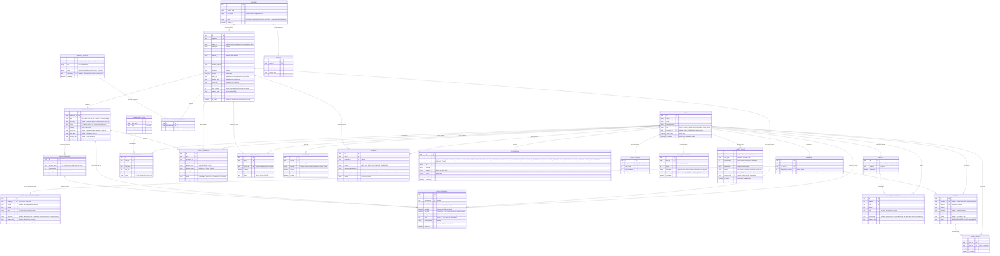

# Entity Relationship Diagram (ERD) - Master Version

This ERD encompasses all system entities: foundational booking logic (Waitlists, Durations), the Aggregator logic (B2B, Packages, QR Check-ins, Payouts), the **Hub → Rooms/Sections hierarchy** (Desks, Meeting Rooms, Theaters, Private Offices, each with its own capacity and rates), **bilingual (Arabic / English) workspace content**, **venue operating hours**, Notifications & OTP, Amenities Management, the Loyalty Points & Rules System, Digital Wallets, the **Corporate Shared Wallet ledger**, and the Customer Support Ticketing System (including Custom Enterprise-style inquiries).

> **Total Entities: 25 | Total Relationships: 33**

```mermaid
erDiagram

    %% ===== CORE ENTITIES =====

    USERS {
        uuid id PK
        string name
        string email
        string password_hash
        enum role "GUEST, B2C, HR_ADMIN, PARTNER_ADMIN, SUPER_ADMIN"
        uuid company_id FK "Nullable - links to COMPANIES if B2B employee"
        boolean email_verified "default false"
        boolean is_banned "default false - moderation status"
    }

    COMPANIES {
        uuid id PK
        string company_name
        uuid hr_admin_id FK
        int total_passes_allocated "Legacy: passes"
        float balance "Corporate shared wallet balance - default 0, only changed through atomic conditional updates"
    }

    COMPANY_WALLET_TRANSACTIONS {
        uuid id PK
        uuid company_id FK "ON DELETE CASCADE"
        uuid user_id "Nullable - who triggered the movement"
        float amount
        string type "DEPOSIT, WITHDRAW, REFUND"
        string description
        string reference_id "Nullable - idempotency key or booking id; unique per company and type in practice"
        float balance_after "Balance right after this movement"
        datetime created_at "Indexed together with company_id"
    }

    PARTNERS {
        uuid id PK
        string brand_name
        string contact_email
        string tax_number "Saudi Commercial Registration (CR)"
        float revenue_share_percentage
        enum status "APPROVED, PENDING_APPROVAL, REJECTED - default APPROVED/PENDING"
        datetime created_at
    }

    %% ===== WORKSPACE & SECTIONS =====

    WORKSPACES {
        uuid id PK
        uuid partner_id FK
        string name "English name"
        string name_ar "Nullable - Arabic name authored by the provider or admin"
        string description "Nullable"
        string description_ar "Nullable - Arabic description"
        string address "Nullable"
        string address_ar "Nullable - Arabic address"
        string city
        string city_ar "Nullable - Arabic city"
        string location_map_url
        float latitude "Nullable"
        float longitude "Nullable"
        string_array images "default empty"
        float daily_rate "Hub default desk daily rate (rooms may override)"
        float monthly_rate "Hub default desk monthly rate"
        float yearly_rate "Hub default desk yearly rate"
        float pass_visit_value "Value compensated to partner per QR check-in"
        int total_capacity "Sum of room capacities when rooms are defined"
        string opening_time "HH:mm, default 08:00"
        string closing_time "HH:mm, default 22:00"
        boolean is_24_hours "default false"
        boolean is_visible "default true - hidden hubs are enforced server-side"
    }

    WORKSPACE_SECTIONS {
        uuid id PK
        uuid workspace_id FK
        enum type "DESK, MEETING_ROOM, THEATER - booking category"
        string sub_type "Nullable - finer room kind, e.g. private-office, training-hall"
        string name "e.g. Meeting Hall A, VIP Theater, Dedicated Desks"
        int capacity "Seats of this room"
        float hourly_rate "Nullable - halls and theaters; falls back to hub rate"
        float daily_rate "Nullable - falls back to hub rate"
        float monthly_rate "Nullable - desks and offices"
        float yearly_rate "Nullable - desks and offices"
    }

    HOURLY_PACKAGES {
        uuid id PK
        uuid section_id FK "Links to MEETING_ROOM or THEATER section"
        string package_name "e.g. 2 Hours Per Day or 8 Hours Per Month"
        int hours_amount
        enum period_type "PER_DAY, PER_MONTH"
        float price
    }

    %% ===== AMENITIES MANAGEMENT =====

    AMENITIES_CATALOG {
        uuid id PK
        string name "e.g. Fast Wi-Fi, Coffee, Cleaning Service"
        string icon "Icon identifier for UI"
        boolean is_default "true = platform default - false = partner suggested"
        enum status "APPROVED, PENDING_APPROVAL, REJECTED"
        uuid requested_by FK "Nullable - null for platform defaults - FK to USERS"
        datetime created_at
    }

    WORKSPACE_AMENITIES {
        uuid id PK
        uuid workspace_id FK
        uuid amenity_id FK "Links to AMENITIES_CATALOG"
    }

    %% ===== PLANS & SUBSCRIPTIONS =====

    MEMBERSHIP_PLANS {
        uuid id PK
        string plan_name
        enum type "B2C, B2B"
        int total_visits_allowed
        float price
    }

    SUBSCRIPTIONS {
        uuid id PK
        uuid user_id FK
        uuid plan_id FK
        date start_date
        date end_date
        int visits_used
        enum status "ACTIVE, EXPIRED, CANCELLED"
    }

    %% ===== BOOKINGS =====

    DIRECT_BOOKINGS {
        uuid id PK
        uuid user_id FK
        uuid workspace_id FK
        uuid section_id FK "Links to WORKSPACE_SECTIONS"
        enum duration_type "DAILY, MONTHLY, YEARLY"
        string duration_details "Nullable - e.g. 3 Days, 2 Months"
        date booking_date
        int seats "default 1 - counted against the room capacity"
        enum status "CONFIRMED, WAITLISTED, CANCELLED, REFUNDED"
        datetime created_at "Used for waitlist queue ordering"
    }

    HOURLY_BOOKINGS {
        uuid id PK
        uuid user_id FK
        uuid workspace_id FK "Nullable"
        uuid section_id FK "The chosen hall or theater"
        uuid package_id FK "Links to HOURLY_PACKAGES"
        datetime start_date "Session start (KSA wall-clock)"
        datetime end_date "Session end - fixed 2-hour sessions for halls and theaters"
        float hours_used "Tracks consumed hours against package"
        int seats "default 1 - never above the room capacity"
        string duration_details "Nullable"
        enum status "ACTIVE, EXPIRED, CANCELLED"
        datetime created_at
    }

    %% ===== VERIFICATION & SECURITY =====

    QR_CHECK_INS {
        uuid id PK
        uuid user_id FK
        uuid workspace_id FK
        uuid section_id FK "Links to WORKSPACE_SECTIONS"
        datetime scanned_at
        string qr_code_hash
        enum status "VALID, FRAUD_ATTEMPT"
    }

    OTP_CODES {
        uuid id PK
        uuid user_id FK
        string code_hash "Hashed OTP code"
        enum purpose "EMAIL_VERIFICATION, PASSWORD_RESET, LOGIN"
        datetime expires_at
        boolean is_used "default false"
        datetime created_at
    }

    %% ===== FINANCIAL =====

    PAYMENTS {
        uuid id PK
        uuid user_id FK
        uuid workspace_id FK "Nullable"
        float amount
        enum method "MADA, VISA, APPLE_PAY, SAMSUNG_PAY, REFUND"
        string gateway_transaction_id
        enum payment_for "DIRECT_BOOKING, HOURLY_BOOKING, SUBSCRIPTION, POINTS_REDEMPTION, REFUND"
        uuid reference_id "FK to the relevant booking or subscription"
        enum status "SUCCESS, FAILED"
        datetime created_at
    }

    PAYOUTS {
        uuid id PK
        uuid partner_id FK
        string billing_month
        int total_visits_received
        float amount_due
        enum status "PENDING, PAID"
    }

    %% ===== NOTIFICATIONS =====

    NOTIFICATIONS {
        uuid id PK
        uuid user_id FK
        enum type "BOOKING_CONFIRMED, BOOKING_CANCELLED, WAITLIST_PROMOTED, MEETING_BOOKED, PAYMENT_SUCCESS, PAYMENT_FAILED, PASS_ASSIGNED, PASS_EXPIRING, ACCOUNT_VERIFIED, POINTS_EARNED, POINTS_REDEEMED, PAYOUT_PROCESSED, PARTNER_APPROVED, AMENITY_REQUEST_STATUS, SUPPORT_TICKET"
        string title
        string message
        enum channel "EMAIL, IN_APP, BOTH"
        boolean is_read "default false"
        datetime sent_at
        datetime created_at
    }

    %% ===== LOYALTY POINTS =====

    LOYALTY_POINTS {
        uuid id PK
        uuid user_id FK "One record per user"
        int total_earned
        int total_redeemed
        int available_balance
    }

    POINTS_TRANSACTIONS {
        uuid id PK
        uuid user_id FK
        enum type "EARNED, REDEEMED"
        int points
        string description "e.g. Earned from monthly booking or Redeemed for daily desk"
        uuid reference_id "Nullable - FK to PAYMENTS or DIRECT_BOOKINGS"
        datetime created_at
    }

    LOYALTY_RULES {
        uuid id PK
        string rule_name "e.g. Earn 10 points per 100 SAR"
        enum rule_type "EARNING, REDEMPTION"
        int points_value "Points earned or required for redemption"
        float monetary_value "SAR amount tied to the rule"
        string description "Detailed rule explanation"
        enum status "APPROVED, PENDING_APPROVAL, REJECTED"
        uuid proposed_by FK "FK to USERS - Partner Admin who proposed"
        uuid approved_by FK "Nullable - FK to USERS - Super Admin"
        boolean is_active "default false until approved"
        datetime created_at
    }

    %% ===== DIGITAL WALLET =====

    WALLETS {
        uuid id PK
        uuid user_id FK "Unique - B2C personal digital wallet"
        float balance "default 0"
        datetime created_at
        datetime updated_at
    }

    WALLET_TRANSACTIONS {
        uuid id PK
        uuid wallet_id FK
        uuid user_id FK
        float amount
        string type "DEPOSIT, WITHDRAW, REFUND"
        string description
        string reference_id "Nullable - idempotency key: a repeated key for the same wallet and type is applied once"
        float balance_after
        datetime created_at
    }

    %% ===== SUPPORT TICKETS =====

    TICKETS {
        uuid id PK
        uuid company_id FK "Nullable - resolved server-side from the requester"
        uuid user_id FK "Requester / submitter"
        string subject
        string message "Nullable - original request text"
        string category "Nullable - general, complaint, refund, enterprise"
        string priority "Nullable - low, medium, high"
        enum status "OPEN, IN_PROGRESS, CLOSED - default OPEN"
        datetime created_at
    }

    TICKET_REPLIES {
        uuid id PK
        uuid ticket_id FK
        uuid user_id FK "Author of response"
        string message
        datetime created_at
    }

    %% ===== RELATIONSHIPS =====

    USERS ||--o{ SUBSCRIPTIONS : "buys packages"
    USERS }o--o| COMPANIES : "is employee of"
    USERS ||--o{ DIRECT_BOOKINGS : "books duration"
    USERS ||--o{ HOURLY_BOOKINGS : "books hourly section"
    USERS ||--o{ PAYMENTS : "makes payments"
    USERS ||--o{ QR_CHECK_INS : "checks in via QR"
    USERS ||--o{ NOTIFICATIONS : "receives"
    USERS ||--o{ OTP_CODES : "verifies with"
    USERS ||--o| LOYALTY_POINTS : "has points balance"
    USERS ||--o{ POINTS_TRANSACTIONS : "earns and redeems"
    USERS ||--o{ LOYALTY_RULES : "proposes rules"
    USERS ||--o| WALLETS : "owns personal wallet"
    USERS ||--o{ WALLET_TRANSACTIONS : "initiates"
    USERS ||--o{ TICKETS : "opens tickets"
    USERS ||--o{ TICKET_REPLIES : "posts replies"

    COMPANIES ||--o{ TICKETS : "has corporate tickets"
    COMPANIES ||--o{ COMPANY_WALLET_TRANSACTIONS : "records shared-wallet ledger"

    WALLETS ||--o{ WALLET_TRANSACTIONS : "records ledger"

    TICKETS ||--o{ TICKET_REPLIES : "has thread replies"

    PARTNERS ||--o{ WORKSPACES : "manages branches"
    PARTNERS ||--o{ PAYOUTS : "earns from platform"
    WORKSPACES ||--o{ WORKSPACE_SECTIONS : "divided into"
    WORKSPACES ||--o{ WORKSPACE_AMENITIES : "features"
    WORKSPACES ||--o{ DIRECT_BOOKINGS : "fulfills bookings"
    WORKSPACES ||--o{ QR_CHECK_INS : "validates check-ins"
    WORKSPACES ||--o{ HOURLY_BOOKINGS : "hosts hourly sessions"
    WORKSPACES ||--o{ PAYMENTS : "receives payments"
    WORKSPACE_SECTIONS ||--o{ DIRECT_BOOKINGS : "booked as"
    WORKSPACE_SECTIONS ||--o{ HOURLY_PACKAGES : "offers hourly packages"
    WORKSPACE_SECTIONS ||--o{ HOURLY_BOOKINGS : "reserved for hourly use"
    HOURLY_PACKAGES ||--o{ HOURLY_BOOKINGS : "applied to booking"
    AMENITIES_CATALOG ||--o{ WORKSPACE_AMENITIES : "selected by workspaces"
    MEMBERSHIP_PLANS ||--o{ SUBSCRIPTIONS : "has subscribers"
```

> 💡 **ملاحظة للفريق:** لرؤية المخطط بشكل مرئي وتفاعلي أوضح، قم بنسخ الكود الخاص بالمخطط (Mermaid) أعلاه، والصقه في موقع [Mermaid Live Editor](https://mermaid.live).

---

## 📌 تفصيل أقسام قاعدة البيانات (ERD Breakdown)

لكي تكون هيكلة قاعدة البيانات واضحة ومقروءة لك، قمنا بتقسيمها إلى **9 أقسام رئيسية**:

### 1. الكيانات الأساسية (Core Entities)
- **`USERS`**: يخزن بيانات جميع المستخدمين (زوار، أفراد، إداريين، شركاء) وصلاحياتهم، وتأكيد البريد الإلكتروني، وحالة الإيقاف والحظر الإداري `is_banned`.
- **`COMPANIES`**: للشركات المنضمة (B2B) وتحديد عدد العضويات المخصصة لموظفيها، بالإضافة إلى رصيد المحفظة المشتركة للمؤسسة `balance` الذي لا يتغير إلا عبر تحديثات ذرية مشروطة (Atomic Conditional Updates) وتُسجَّل كل حركة فيه في `COMPANY_WALLET_TRANSACTIONS`.
- **`PARTNERS`**: شركاء مساحات العمل وبياناتهم الضريبية والسجل التجاري السعودي (CR / `tax_number`)، وحالة اعتماد الشريك من قِبل الـ Super Admin (`APPROVED`, `PENDING_APPROVAL`, `REJECTED`).

### 2. المساحات والمرافق (Workspace & Sections)
- **`WORKSPACES` (المقر / Hub):** المعلومات العامة للمبنى: الاسم والوصف والعنوان والمدينة بنسختين **عربية وإنجليزية** (`name`/`name_ar`، `description`/`description_ar`، `address`/`address_ar`، `city`/`city_ar`)، الإحداثيات، الصور، **ساعات التشغيل** (`opening_time`، `closing_time`، `is_24_hours`)، وحالة الظهور `is_visible`. تُحرَّر النسخة العربية يدوياً من الشريك أو الإدارة ولا تُترجم آلياً؛ وعند غيابها تُعرض النسخة الإنجليزية كبديل.
- **`WORKSPACE_SECTIONS` (الغرف والأقسام / Rooms):** كل قسم يتبع مقراً واحداً وله نوعه (`type`: DESK / MEETING_ROOM / THEATER) ونوعه الأدق (`sub_type` مثل مكتب خاص أو قاعة تدريب) وسعته `capacity` وأسعاره (`hourly_rate`، `daily_rate`، `monthly_rate`، `yearly_rate`). الأسعار الفارغة تعود إلى أسعار المقر. تُرتبط كل الحجوزات بالقسم المختار عبر `section_id`.
- **`HOURLY_PACKAGES`**: باقات الساعات المخصصة لقاعات الاجتماعات والمسارح (مثل: باقة 8 ساعات/شهر).

### 3. إدارة الميزات (Amenities Management)
- **`AMENITIES_CATALOG`**: القاموس الشامل للميزات (الافتراضية من المنصة + التي يقترحها الشركاء وتنتظر الموافقة).
- **`WORKSPACE_AMENITIES`**: جدول وسيط (Junction) يربط بين كل مساحة عمل والميزات المتوفرة فيها.

### 4. الحجوزات والعضويات (Plans & Bookings)
- **`MEMBERSHIP_PLANS` & `SUBSCRIPTIONS`**: لتخزين العضويات الشاملة (Universal Pass) ومدة اشتراك المستخدم فيها.
- **`DIRECT_BOOKINGS`**: الحجوزات المباشرة الثابتة للمكاتب (باليوم، الشهر، السنة) ويشمل طابور الانتظار وحالات الإلغاء والاسترجاع (`REFUNDED`).
- **`HOURLY_BOOKINGS`**: حجوزات القاعات والمسارح بجلسات ثابتة مدتها ساعتان، مرتبطة بالقاعة المحددة `section_id` وبعدد المقاعد `seats` الذي لا يتجاوز سعتها.

### 5. الدفع والمالية (Financial)
- **`PAYMENTS`**: جميع عمليات الدفع والاسترداد المالي (`REFUND`) عبر البطاقات البنكية، أبل باي، أو المحفظة.
- **`PAYOUTS`**: التسويات المالية التي تصرفها المنصة شهرياً لكل شريك بناءً على الزيارات المحققة.

### 6. التحقق والأمان (Verification & Security)
- **`QR_CHECK_INS`**: السجل اللحظي لمسح رموز الـ QR عند أبواب مساحات العمل للتحقق من الدخول.
- **`OTP_CODES`**: تخزين أكواد التحقق المؤقتة لتسجيل الحسابات، تسجيل الدخول، واستعادة كلمة المرور لضمان تشفيرها ومدة صلاحيتها.

### 7. الإشعارات ونقاط الولاء (Notifications & Loyalty)
- **`NOTIFICATIONS`**: جميع الإشعارات الصادرة (بريد أو تطبيق) لكل مستخدم وتتبع حالة قراءتها ومناسباتها المختلفة.
- **`LOYALTY_RULES`**: اقتراحات الشركاء لقواعد النقاط والتي يراجعها الـ Super Admin للموافقة والتفعيل.
- **`LOYALTY_POINTS` & `POINTS_TRANSACTIONS`**: رصيد كل مستخدم من النقاط وسجل الاكتساب والاستبدال.

### 8. المحافظ الرقمية (Digital Wallets & Ledger)
- **`WALLETS`**: المحفظة الرقمية الخاصة بكل مستخدم، تتيح شحن الرصيد المسبق والدفع الفوري، واستقبال مبالغ الاسترداد بشكل لحظي دون انتظار مواعيد البنوك.
- **`WALLET_TRANSACTIONS`**: سجل حركات الإيداع والسحب والاسترداد (`DEPOSIT`, `WITHDRAW`, `REFUND`) مع تتبع الرصيد بعد كل معاملة `balance_after`. يعمل `reference_id` كمفتاح عدم التكرار (Idempotency Key).
- **`COMPANY_WALLET_TRANSACTIONS`**: دفتر حركات المحفظة المؤسسية المشتركة بنفس البنية (`DEPOSIT`, `WITHDRAW`, `REFUND`) مع `balance_after`؛ يُحذف تلقائياً مع الشركة (`ON DELETE CASCADE`).

### 9. التذاكر والدعم الفني (Support Tickets)
- **`TICKETS`**: تذاكر الدعم الفني المرفوعة من المستخدمين والشركات (بما فيها استفسارات الباقات المخصصة بفئة `enterprise`) مع النص `message` والفئة `category` والأولوية `priority` وتتبع الحالة (`OPEN`, `IN_PROGRESS`, `CLOSED`). الشركة اختيارية وتُحدَّد من سجل الطالب في الخادم.
- **`TICKET_REPLIES`**: سجل الردود والمراسلات المتبادلة بين إدارة المنصة والمستخدم لحل المشكلات والنزاعات.

---

## 🔐 قواعد سلامة البيانات (Data Integrity Rules)

| القاعدة | التطبيق |
| :--- | :--- |
| **الحجز مرتبط بالقسم** | كل `DIRECT_BOOKINGS` و`HOURLY_BOOKINGS` يحمل `section_id` للغرفة المحجوزة؛ والقسم لا يُحذف إن كان عليه حجوزات أو تسجيلات دخول. |
| **السعة لكل غرفة** | الحجز المباشر يُقارن بمجموع مقاعد الغرفة نفسها عند تعدد الغرف في المقر، وبسعة المقر عند وجود غرفة واحدة. |
| **جلسات القاعات والمسارح** | جلسة ثابتة مدتها ساعتان بين `opening_time` و`closing_time` وتنتهي بحد أقصى 10:00 م؛ والغرفة تُحجز لجلسة واحدة في كل مرة (لا تداخل زمني على نفس `section_id`)، ولا تُقفل بقية اليوم. |
| **الأرصدة** | تُخصم بتحديث ذري مشروط داخل معاملة قاعدة بيانات (`balance >= amount`)؛ ولا يمكن للرصيد أن يصبح سالباً. |
| **عدم التكرار** | مفتاح `reference_id` لنفس المحفظة ونفس النوع يُطبَّق مرة واحدة فقط، لمنع الخصم أو الاسترداد المزدوج. |
| **الحذف المتسلسل** | حذف مستخدم أو شريك يزيل بياناتهما التابعة بالترتيب الصحيح عبر `cascade-delete` دون كسر المفاتيح الأجنبية. |
| **إخفاء المساحات** | المقر ذو `is_visible = false` لا يظهر ولا يُحجز لغير المشرف ومالك المقر، ويُفرض ذلك في الخادم. |
