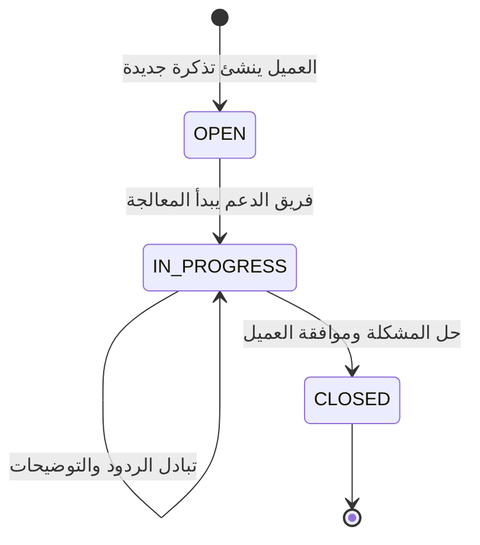

# خطة سير خدمة العملاء (Support Workflow) - Coworking Pass

يهدف هذا الدليل لتوضيح الإجراءات القياسية (SOPs) المتبعة من قِبل إدارة المنصة وفريق خدمة العملاء للتعامل مع التذاكر والشكاوى والمشكلات التقنية والمالية، لضمان أعلى مستوى من رضا العملاء والشركاء وسرعة الاستجابة.

---

## 1. قنوات الدعم المعتمدة
* **نظام التذاكر المدمج بالمنصة (In-Platform Ticketing System):** القناة الرسمية الأساسية لجميع المستخدمين (أفراد B2C وشركات B2B). تتيح إنشاء تذاكر ومتابعة الردود بسجل موثق (`Ticket` & `TicketReply`).
* **البريد الإلكتروني المباشر:** للمراسلات الرسمية والنزاعات المالية الكبرى مع الشركاء.
* **الدردشة المباشرة (Live Chat):** للاستفسارات السريعة وتوجيه الزوار الجدد في الموقع.

---

## 2. دورة حياة تذاكر الدعم الفني ومستويات الخدمة (Ticket SLAs)
يتم تصنيف ومعالجة جميع التذاكر وفق الحالات التالية:

* **وقت الاستجابة الأول (First Response SLA):** أقل من **ساعتين (2h)** خلال ساعات العمل.
* **زمن الحل النهائي (Resolution SLA):** أقل من **24 ساعة** للمشكلات التشغيلية، وأقل من **48 ساعة** للنزاعات المالية.

---

## 3. سيناريوهات المشاكل وإجراءات العمل القياسية (SOPs)

### السيناريو أ: فشل مسح رمز الـ QR عند الدخول
* **المشكلة:** العميل لديه حجز نشط، ولكن جهاز موظف الاستقبال لا يقرأ الكود، أو تظهر رسالة "رمز غير صالح".
* **الإجراء (SOP):**
  1. يُطلب من العميل تحديث الصفحة للتأكد من توليد رمز جديد غير منتهٍ (TOTP).
  2. إذا استمرت المشكلة، يقوم موظف الاستقبال بالبحث عن اسم العميل أو بريده يدوياً في "لوحة تحكم الشريك" وتأكيد حضوره.
  3. يرفع موظف الاستقبال أو العميل تذكرة دعم فني للتحقق من مزامنة الوقت (Time Sync) في الخوادم.

### السيناريو ب: المساحة ممتلئة رغم وجود حجز مؤكد (Overbooking)
* **المشكلة:** يصل العميل للمساحة ويجد أنه لا يوجد مقعد متاح، رغم أن حجزه في المنصة "مؤكد".
* **الإجراء (SOP):**
  1. الاعتذار الفوري للعميل، ويُلزم الشريك بتوفير مقعد بديل مؤقت في المساحة.
  2. في حال تعذر التوفير، يُنفذ فوراً **استرجاع مالي فوري وكامل إلى محفظته الرقمية (Instant Wallet Refund)** دون أي تأخير.
  3. إضافة 500 نقطة ولاء مجانية لحساب العميل كاعتذار من المنصة.
  4. تسجيل إنذار تشغيلي على الشريك لعدم ضبط السعة الاستيعابية في نظام الأقسام.

### السيناريو ج: طلبات استرجاع الأموال وإلغاء الحجوزات والباقات (Refunds)
* **المشكلة:** العميل أو الشركة قامت بإلغاء حجز مباشر أو باقة ساعات أو اشتراك عضوية شاملة وتطلب استرداد الأموال.
* **الإجراء (SOP):**
  1. فحص نوع الطلب والمعايير النظامية:
     - **الحجوزات المباشرة للمكاتب وقاعات الاجتماعات:** يجب أن يكون الإلغاء قبل **6 ساعات** للأفراد B2C وقبل **24 ساعة** للمؤسسات B2B من موعد بدء الحجز.
     - **باقات العضوية الشاملة (Universal Pass):** فحص تاريخ الشراء وسجل الزيارات. إذا كان الطلب خلال **3 أيام (72 ساعة)** من الشراء وكان عدد الزيارات صفراً (`visitsUsed == 0`)، يُقبل الاسترجاع بالكامل فوراً.
     - **باقات الساعات (Hourly Packages):** تُعاد الساعات الملغاة لرصيد الباقة إذا أُلغيت قبل موعدها (6 ساعات/24 ساعة). أما استرداد قيمة باقة الساعات المالية، فيُشترط عدم استهلاك أي ساعة منها وخلال 3 أيام من الشراء.
  2. في حال الأهلية، يُوجه العميل للاستفادة من **الاسترجاع الفوري للمحفظة (Instant Wallet)** حيث يُودع المبلغ في ثوانٍ معدودة، أو الاسترجاع للبطاقة البنكية الذي يتطلب 5-14 يوم عمل.
  3. تغيير حالة الحجز تلقائياً إلى `REFUNDED` أو إلغاء الاشتراك في جدول `SUBSCRIPTIONS` وتسجيل القيد في `WALLET_TRANSACTIONS`.
  4. في حالات الشكاوى الخاصة (مثل تعطل فرع أو سوء الخدمة بعد بدء الباقة واستهلاك زيارات)، يملك الـ Super Admin صلاحية تقدير وإيداع تعويض جزئي أو كامل مباشرة في محفظة العميل الرقمية لضمان رضاه.

### السيناريو د: تعطل الدفع أو الخصم المزدوج
* **المشكلة:** تم خصم المبلغ من حساب العميل البنكي دون تأكيد الحجز في المنصة.
* **الإجراء (SOP):**
  1. التحقق من رقم المعاملة البنكية وتطابقها في سجل بوابة الدفع.
  2. في حال ثبت وصول المبلغ ولم يتفعل الحجز، يقوم المشرف فوراً إما بتأكيد الحجز يدوياً أو شحن محفظة العميل الرقمية بنفس القيمة فوراً لتمكينه من إعادة الحجز بلحظتها.

### السيناريو هـ: اعتراضات اعتماد الشركاء والسجل التجاري (Partner CR Disputes)
* **المشكلة:** شريك سجل حسابه وبقي معلقاً (`PENDING_APPROVAL`) أو تم رفضه (`REJECTED`) بسبب عدم وضوح السجل التجاري.
* **الإجراء (SOP):**
  1. مراجعة بيانات الشريك في لوحة تحكم الـ Super Admin وتدقيق رقم السجل التجاري السعودي في منصة وزارة التجارة / واثق.
  2. إذا كان السجل صالحاً ومطابقاً للنشاط، يتم تحويل الحالة إلى `APPROVED`، ويقوم النظام بإرسال بريد ترحيبي وتفعيلي تلقائي عبر **Resend**.
  3. في حال وجود نقص أو انتهاء صلاحية السجل، يتم الرد على الشريك بتحديد المتطلب الناقص لإعادة رفعه.

### السيناريو و: معالجة الحسابات المحظورة والمخالفات السلوكية (Account Moderation)
* **المشكلة:** مستخدم يطعن في قرار حظر حسابه (`isBanned`).
* **الإجراء (SOP):**
  1. فتح سجلات نشاط المستخدم ومراجعة تقرير مسحات الـ QR والشكاوى المقدمة من مساحات العمل.
  2. في حال كان الحظر ناتجاً عن خطأ تقني غير مقصود، يقوم الـ Super Admin برفع الحظر فوراً (`isBanned = false`).
  3. في حال ثبوت الاحتيال أو مخالفة سياسة السلوك، يتم إشعار المستخدم بالقرار النهائي وتأكيد إغلاق الحساب.
