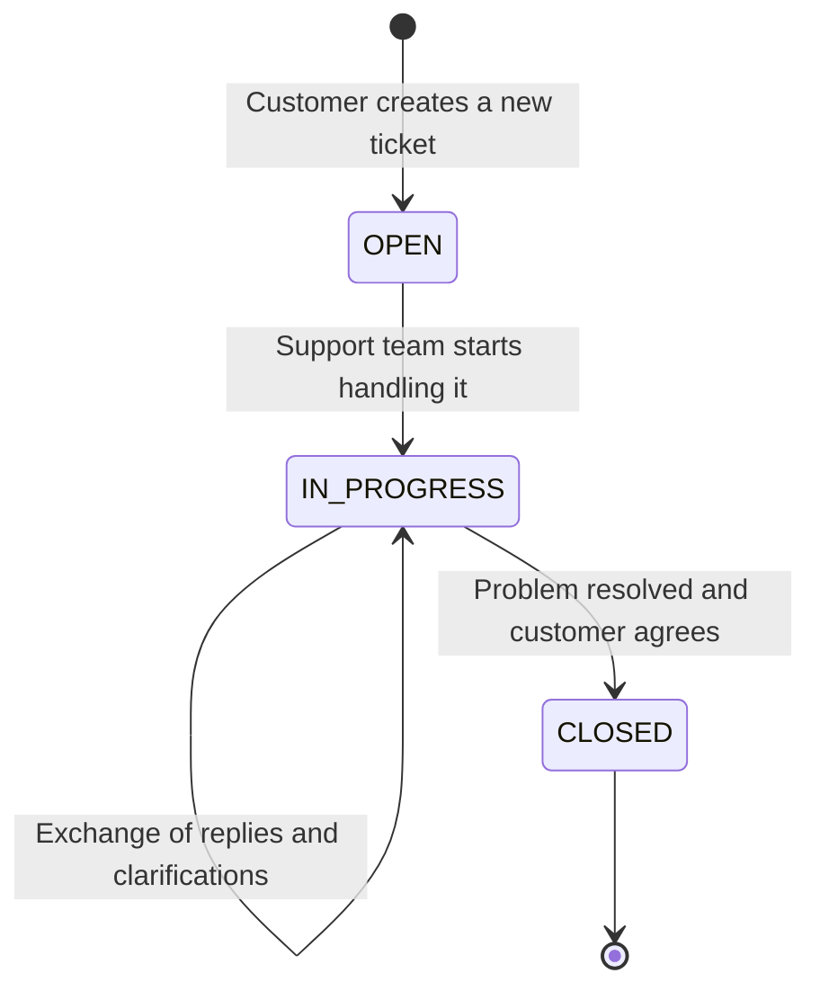

# Support Workflow — Coworking Pass

This guide sets out the standard operating procedures (SOPs) followed by the platform administration and the customer-service team to handle tickets, complaints, and technical and financial problems, to ensure the highest level of customer and partner satisfaction and fast response.

---

## 1. Approved Support Channels
* **In-Platform Ticketing System:** the main official channel for all users (B2C individuals and B2B companies). It allows creating tickets and following replies with a documented record (`Ticket` & `TicketReply`). Tickets carry a category (general, complaint, refund, enterprise) and a priority.
* **Direct email:** for official correspondence and major financial disputes with partners.
* **Live chat:** for quick inquiries and guiding new visitors on the site.

---

## 2. Support Ticket Lifecycle and Service Levels (Ticket SLAs)
All tickets are classified and processed according to the following states:

```mermaid
stateDiagram-v2
    [*] --> OPEN: Customer creates a new ticket
    OPEN --> IN_PROGRESS: Support team starts handling it
    IN_PROGRESS --> IN_PROGRESS: Exchange of replies and clarifications
    IN_PROGRESS --> CLOSED: Problem resolved and customer agrees
    CLOSED --> [*]
```

* **First response SLA:** under **two hours (2h)** during working hours.
* **Resolution SLA:** under **24 hours** for operational problems, and under **48 hours** for financial disputes.
* **Notifications:** every administrator receives an in-app notification when a ticket is created (the `enterprise` category is highlighted), and the ticket owner is notified when support replies. The full conversation is visible in the admin panel, and an administrator can reply even after a ticket is closed.

---

## 3. Problem Scenarios and Standard Operating Procedures (SOPs)

### Scenario A: QR code scan fails at entry
* **Problem:** the customer has an active booking, but the reception device does not read the code, or an "invalid code" message appears.
* **Procedure (SOP)**
  1. Ask the customer to refresh the page to make sure a new, unexpired code (TOTP) is generated.
  2. If the problem persists, reception staff search for the customer's name or email manually in the "partner dashboard" and confirm their attendance.
  3. Reception staff or the customer raise a support ticket to verify time synchronization (Time Sync) on the servers.

### Scenario B: The space is full despite a confirmed booking (Overbooking)
* **Problem:** the customer arrives at the space and finds no seat available, although their booking on the platform is "confirmed".
* **Procedure (SOP)**
  1. Apologize to the customer immediately, and require the partner to provide a temporary alternative seat in the space.
  2. If that is not possible, execute an immediate **full instant refund to their digital wallet (Instant Wallet Refund)** without delay.
  3. Add 500 free loyalty points to the customer's account as an apology from the platform.
  4. Record an operational warning against the partner for not setting the capacity correctly in the rooms and sections system.

### Scenario C: Refund and cancellation requests for bookings and packages (Refunds)
* **Problem:** a customer or company cancelled a direct booking, an hour package or a Universal Pass subscription and requests a refund.
* **Procedure (SOP)**
  1. Check the request type and the regulatory criteria:
     - **Direct bookings of desks and meeting rooms:** cancellation must be at least **6 hours** before for B2C individuals and **24 hours** before for B2B organizations from the booking start time.
     - **Universal Pass:** check the purchase date and the visit record. If the request is within **3 days (72 hours)** of purchase and the number of visits is zero (`visitsUsed == 0`), the refund is accepted in full immediately.
     - **Hour packages:** cancelled hours return to the package credit if cancelled before their time (6 hours / 24 hours). A monetary refund of the hour package requires that no hour of it was used and that it is within 3 days of purchase.
  2. If eligible, guide the customer to the **Instant Wallet refund**, where the amount is deposited within seconds, or to the refund to the bank card, which takes 5–14 business days.
  3. The booking status changes automatically to `REFUNDED`, or the subscription is cancelled in the `SUBSCRIPTIONS` table, and the entry is recorded in the wallet ledger (`WALLET_TRANSACTIONS`, or `COMPANY_WALLET_TRANSACTIONS` for corporate accounts). The refund runs in one transaction and cannot be applied twice.
  4. For special complaints (such as a branch breakdown or poor service after the package started and visits were used), the Super Admin has the authority to assess and deposit a partial or full compensation directly into the customer's digital wallet to ensure their satisfaction.

### Scenario D: Payment failure or double charge
* **Problem:** the amount was deducted from the customer's bank account without the booking being confirmed on the platform.
* **Procedure (SOP)**
  1. Verify the bank transaction number and that it matches the payment gateway log.
  2. If the amount is confirmed received and the booking was not activated, the administrator either confirms the booking manually or immediately tops up the customer's digital wallet with the same amount so they can rebook at once.
  3. If the money was taken from a wallet and the booking was rejected by the server (for example a room conflict), the amount is returned to the same wallet automatically; if the customer reports that this did not happen, verify the refund entry in the wallet ledger and credit it manually if missing.

### Scenario E: Partner approval and commercial-registration disputes (Partner CR Disputes)
* **Problem:** a partner registered an account that remained pending (`PENDING_APPROVAL`) or was rejected (`REJECTED`) because the commercial registration was unclear.
* **Procedure (SOP)**
  1. Review the partner's data in the Super Admin dashboard and audit the Saudi commercial registration number on the Ministry of Commerce / Wathiq platform.
  2. If the registration is valid and matches the activity, change the status to `APPROVED`, and the system automatically sends a welcome and activation email through **Resend**.
  3. If the registration is incomplete or expired, reply to the partner specifying the missing requirement so it can be uploaded again.

### Scenario F: Handling banned accounts and behavioral violations (Account Moderation)
* **Problem:** a user challenges the decision to ban their account (`isBanned`).
* **Procedure (SOP)**
  1. Open the user's activity records and review the QR-scan report and complaints submitted by the workspaces.
  2. If the ban resulted from an unintentional technical error, the Super Admin lifts the ban immediately (`isBanned = false`).
  3. If fraud or a violation of the code of conduct is proven, notify the user of the final decision and confirm the account's closure.
