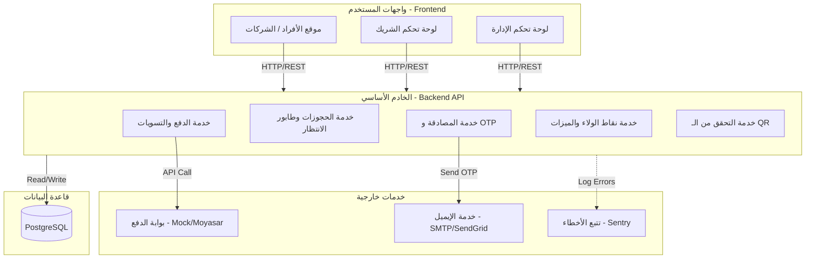

# الهيكلية التقنية للنظام (System Architecture) - Coworking Pass

يوضح هذا المستند المعمارية التقنية للمنصة، تدفق البيانات بين المكونات، والتقنيات المستخدمة.

## 1. التقنيات المستخدمة (Tech Stack)
- **واجهة المستخدم (Frontend):** Next.js (React), Tailwind CSS.
- **الخوادم (Backend):** Next.js API Routes (لبرمجة مسارات الـ API).
- **قاعدة البيانات (Database):** PostgreSQL (قاعدة بيانات علائقية متينة تناسب الأنظمة المالية والحجوزات).
- **أدوات مساعدة (Tools):** Prisma ORM للتعامل مع قاعدة البيانات، و JWT لمصادقة المستخدمين.

## 2. مخطط معمارية النظام (Architecture Diagram)

## 3. تدفق العمليات المعقدة (Complex Flows)

### أ. تدفق الدفع وتأكيد الحجز (Payment & Booking Flow)
1. يختار المستخدم خطة الحجز ويرسل طلب الدفع من الواجهة.
2. يستقبل الـ Backend الطلب ويحيله إلى (خدمة الدفع الوهمية حالياً).
3. تُعيد خدمة الدفع استجابة `Success`.
4. يقوم الـ Backend بالمهام المتسلسلة التالية:
   - يغير حالة الحجز إلى `CONFIRMED`.
   - يحسب ويضيف نقاط الولاء للمستخدم في جدول `LOYALTY_POINTS`.
   - يرسل إشعار تأكيد للعميل (Email + In-Site).

### ب. تدفق مسح الـ QR (QR Check-in Flow)
1. يُنشئ النظام رمز QR ديناميكي يحتوي على الـ `uuid` للحجز ووقت صلاحية مؤقت (TOTP).
2. يمسح موظف الاستقبال الكود باستخدام جهازه اللوحي أو جواله.
3. يُرسل الـ Frontend طلب فحص إلى `API_QR`.
4. يُطابق الـ Backend الرمز مع قاعدة البيانات:
   - **صالح:** يُسجل الدخول في `QR_CHECK_INS`، ويخصم الساعات (إذا كان الحجز لقاعة/مسرح).
   - **غير صالح:** يُرسل رسالة خطأ وتسجل محاولة احتيال `FRAUD_ATTEMPT`.

## 4. استضافة النظام وتوطين البيانات (Hosting & Deployment)
* **واجهات المستخدم (Frontend):** يمكن استضافتها على منصات مرنة مثل (Vercel) لضمان سرعة الاستجابة الجغرافية.
* **قاعدة البيانات (Database):** للامتثال لأنظمة حماية البيانات السعودية (PDPL)، يُفضل استضافة قاعدة البيانات داخل المملكة العربية السعودية (مثل: مراكز بيانات AWS في الرياض، أو Google Cloud في الدمام).
* **إدارة النشر (CI/CD):** استخدام GitHub Actions لأتمتة فحص ورفع الكود للسيرفر عند دمج أي تحديث جديد في فرع `main`.
