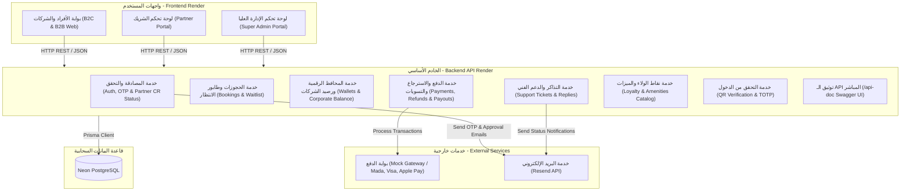

# الهيكلية التقنية للنظام (System Architecture) - Coworking Pass

يوضح هذا المستند المعمارية التقنية للمنصة، تدفق البيانات بين المكونات، والتقنيات المستخدمة في بيئة التطوير والإنتاج.

## 1. التقنيات المستخدمة (Tech Stack)
- **واجهة المستخدم والخوادم البرمجية (Frontend & Backend):** تطبيق متكامل مبني بتقنيات Next.js (React), Tailwind CSS, Lucide Icons, Node.js, Express, و TypeScript (مستضاف ومُدار بالكامل على منصة **Render** كخدمة ويب سحابية موحدة).
- **قاعدة البيانات (Database):** **Neon PostgreSQL** (قاعدة بيانات علائقية سحابية Serverless متوافقة مع متطلبات الأنظمة المالية والحجوزات).
- **محرك البيانات (ORM):** Prisma ORM v6 للتعامل مع قاعدة البيانات وتوليد الهجرات البرمجية (Migrations).
- **المصادقة والأمان (Auth & Security):** JWT (JSON Web Tokens)، تشفير كلمات المرور بـ bcryptjs، نظام صلاحيات مبني على الأدوار (RBAC)، والتحقق من رموز الدخول المتغيرة (TOTP).
- **خدمة البريد الإلكتروني (Transactional Email):** **Resend API** لإرسال أكواد التحقق (OTP)، إشعارات تأكيد الحجوزات، وإشعارات قبول أو رفض اعتماد الشركاء (CR Verification).
- **التوثيق البرمجي المفتوح (API Documentation):** توثيق تفاعلي كامل وفق معايير OpenAPI 3.0 عبر **Swagger UI** متاح عبر المسار المباشر `/api-doc`.

---

## 2. مخطط معمارية النظام (Architecture Diagram)

---

## 3. تدفق العمليات المعقدة (Complex Flows)

### أ. دورة التحقق من شركاء المساحات واعتماد السجل التجاري (Partner CR Verification Lifecycle)
1. يقوم الشريك الجديد بتسجيل حسابه واختيار صفة الشريك (Partner Admin)، مع إدخال رقم السجل التجاري السعودي (CR Number / `taxNumber`).
2. يقوم النظام بإنشاء حساب الشريك بحالة مبدئية `PENDING_APPROVAL`.
3. في حال محاولة الشريك تسجيل الدخول قبل الاعتماد، تمنع بوابة المصادقة وصوله وتعيد استجابة `HTTP 403 Forbidden` برسالة تفيد بتعليق الحساب لحين انتهاء مراجعة الإدارة.
4. يظهر طلب الشريك الجديد وبيانات سجله التجاري في لوحة تحكم الإدارة العليا (`Super Admin Dashboard`).
5. يقوم الـ Super Admin بالتحقق من صحة السجل التجاري:
   - **في حال الاعتماد (Approved):** تتغير حالة الشريك إلى `APPROVED`، ويُرسل له إشعار بريد ترحيبي عبر **Resend** يبلغه بتفعيل حسابه وقدرته على إدارة فروعه ومساحاته واستقبال الحجوزات.
   - **في حال الرفض (Rejected):** تتغير الحالة إلى `REJECTED` ويتم إشعاره بسبب الرفض ومطالبته بتصحيح المستندات.

### ب. تدفق المحافظ الرقمية واسترجاع الحجوزات والباقات (Wallets & Refunds Flow)
1. **المحفظة الشخصية (B2C Wallet):** يمكن للمستخدم شحن رصيده مقدماً والدفع بضغطة زر واحدة.
2. **المحفظة المؤسسية المشتركة (B2B Corporate Wallet):** يقوم مدير الموارد البشرية بشحن رصيد الشركة الموحد (`Company.balance`)، مما يمكّن الموظفين التابعين من الحجز المباشر بالخصم اللحظي من رصيد الشركة.
3. **محرك الإلغاء والاسترجاع المؤتمت (Direct Bookings vs Packages):**
   - **الحجوزات المباشرة للمكاتب وقاعات الاجتماعات:** إلغاء مجاني مع استرداد كامل قبل موعد الحجز (قبل 6 ساعات للأفراد، وقبل 24 ساعة للمؤسسات) لتمكين ترقية طابور الانتظار.
   - **باقات العضوية الشاملة (Universal Pass):** استرجاع كامل متاح خلال **3 أيام (72 ساعة)** من تاريخ الشراء بشرط عدم استخدام أي زيارة (`visitsUsed == 0`).
   - **باقات الساعات:** إعادة الساعات غير المستهلكة لرصيد الباقة عند إلغاء الجلسة مسبقاً، مع إمكانية استرداد قيمة الباقة كاملة خلال 3 أيام إذا لم تُستهلك ساعاتها.
   - **طرق صرف الاسترجاع:**
     - **المحفظة الرقمية (Wallet):** تضاف القيمة فوراً وبلحظتها إلى محفظة المستخدم بدون أي تأخير، مع تسجيل حركة في `WALLET_TRANSACTIONS`.
     - **البطاقة البنكية:** يُرسل طلب استرجاع لبوابة الدفع ويستغرق من 5 إلى 14 يوم عمل.

### ج. دورة حياة تذاكر الدعم الفني (Support Ticketing Lifecycle)
1. يقوم العميل أو مدير الموارد البشرية بفتح تذكرة دعم فني جديدة (`Ticket`) مع تحديد الموضوع والوصف.
2. تُسجل التذكرة بحالة `OPEN` وتظهر فوراً في لوحة تحكم الإدارة العليا.
3. يطّلع فريق الدعم على التذكرة ويقوم بالرد عليها وإحالتها إلى `IN_PROGRESS`.
4. يستطيع المستخدم إضافة ردود واستفسارات متتابعة (`TicketReply`) داخل نفس خيط المحادثة.
5. عند إنهاء المشكلة وإرضاء العميل، يتم تغيير حالة التذكرة إلى `CLOSED`.

### د. تدفق مسح الـ QR والتحقق الأمني (QR Check-in Flow)
1. يُنشئ النظام رمز QR ديناميكي مؤقت ومحمي يعتمد على (TOTP) مرتبط برقم الحجز أو العضوية الشاملة.
2. يمسح موظف الاستقبال الكود باستخدام جهازه اللوحي أو جواله في الاستقبال.
3. يُرسل الطلب إلى نقطة التحقق في الـ Backend:
   - **صالح (Valid):** يُسجل الدخول في جدول `QR_CHECK_INS`، ويتم خصم الساعات إذا كان الحجز لقاعة اجتماعات أو مسرح.
   - **غير صالح أو منتهي:** يُرفض الدخول فوراً ويُسجل كـ `FRAUD_ATTEMPT` في سجلات الأمان.

---

## 4. استضافة النظام وتوطين البيانات (Hosting & Deployment)
* **الواجهات والخوادم البرمجية (Frontend & Backend):** مستضافة بالكامل على منصة **Render** كخدمة ويب سحابية موحدة تجمع واجهات Next.js وخوادم الـ API لضمان الأداء المستقر وسهولة الإدارة.
* **قاعدة البيانات (Database):** مستضافة على منصة **Neon Tech** (Serverless PostgreSQL) مع توفير نسخ احتياطية مؤتمتة وأداء عالي وقابلية توسع فورية.
* **خدمة البريد (Email API):** مدمجة مع منصة **Resend** لضمان تسليم فوري لرسائل البريد الإلكتروني دون الوقوع في مجلد الرسائل غير المرغوب فيها (Spam).
* **إدارة النشر (CI/CD):** ربط تلقائي لمستودع GitHub بحيث يتم نشر أي تحديثات فور مراجعتها والتأكد من استقرارها.
