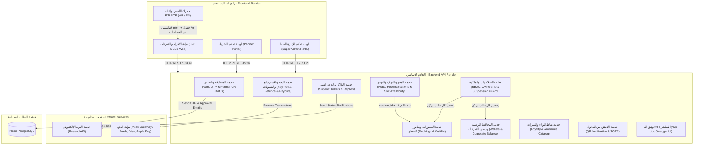

# الهيكلية التقنية للنظام (System Architecture) - Coworking Pass

يوضح هذا المستند المعمارية التقنية للمنصة، تدفق البيانات بين المكونات، والتقنيات المستخدمة في بيئة التطوير والإنتاج.

## 1. التقنيات المستخدمة (Tech Stack)
- **الواجهة الأمامية (Frontend):** تطبيق **Next.js 16** (App Router، Turbopack) مع **React 19** و**TypeScript** و**Tailwind CSS 4** وأيقونات Lucide، بخط **Tajawal** عبر `next/font` للنصوص العربية.
- **الخادم (Backend API):** مسارات API مبنية بـ **Next.js Route Handlers** (`app/api/**/route.ts`) على Node.js مع TypeScript، تتعامل مع قاعدة البيانات عبر Prisma. (تنبيه: لا يوجد خادم Express منفصل.)
- **الاستضافة:** الواجهة والخادم كلاهما مستضاف على منصة **Render** كخدمات ويب سحابية.
- **قاعدة البيانات (Database):** **Neon PostgreSQL** (قاعدة بيانات علائقية سحابية Serverless متوافقة مع متطلبات الأنظمة المالية والحجوزات).
- **محرك البيانات (ORM):** Prisma ORM v6 للتعامل مع قاعدة البيانات وتوليد الهجرات البرمجية (Migrations).
- **المصادقة والأمان (Auth & Security):** JWT (JSON Web Tokens) بصلاحية 24 ساعة مع قائمة إبطال عند الخروج وفحص الحظر من قاعدة البيانات عند كل طلب، تشفير كلمات المرور بـ bcryptjs، نظام صلاحيات مبني على الأدوار (RBAC)، والتحقق من رموز الدخول المتغيرة (TOTP)، مع دعم معيار اختيار مفتاح الدولة الدولي (Country Code Picker) ومكتبة التحقق المعيارية للهواتف (E.164 format) بدلاً من الفحص برمز تعبيري سعودي ثابت.
- **خدمة البريد الإلكتروني (Transactional Email):** **Resend API** لإرسال أكواد التحقق (OTP)، إشعارات تأكيد الحجوزات، وإشعارات قبول أو رفض اعتماد الشركاء (CR Verification).
- **التدويل (i18n):** قواميس ترجمة JSON (`ar` / `en`) بنوع صارم مع مزوّد لغة (`I18nProvider`) وطبقة رسائل النظام؛ انظر القسم 5.
- **التوثيق البرمجي المفتوح (API Documentation):** توثيق تفاعلي كامل وفق معايير OpenAPI 3.0 عبر **Swagger UI** متاح عبر المسار المباشر `/api-doc`.

---

## 2. مخطط معمارية النظام (Architecture Diagram)

```mermaid
graph TD
    %% User Interfaces
    subgraph Frontend [واجهات المستخدم - Frontend Render]
        UI_User["بوابة الأفراد والشركات (B2C & B2B Web)"]
        UI_Partner["لوحة تحكم الشريك (Partner Portal)"]
        UI_Admin["لوحة تحكم الإدارة العليا (Super Admin Portal)"]
        UI_I18n["محرك اللغتين واتجاه RTL/LTR (AR / EN)"]
    end

    %% Backend Services
    subgraph Backend [الخادم الأساسي - Backend API Render]
        API_Auth["خدمة المصادقة والتحقق (Auth, OTP & Partner CR Status)"]
        API_Booking["خدمة الحجوزات وطابور الانتظار (Bookings & Waitlist)"]
        API_Wallet["خدمة المحافظ الرقمية ورصيد الشركات (Wallets & Corporate Balance)"]
        API_Billing["خدمة الدفع والاسترجاع والتسويات (Payments, Refunds & Payouts)"]
        API_Tickets["خدمة التذاكر والدعم الفني (Support Tickets & Replies)"]
        API_Loyalty["خدمة نقاط الولاء والميزات (Loyalty & Amenities Catalog)"]
        API_Hub["خدمة المقر والغرف والتوفر (Hubs, Rooms/Sections & Slot Availability)"]
        API_Guard["طبقة الصلاحيات والملكية (RBAC, Ownership & Suspension Guard)"]
        API_QR["خدمة التحقق من الدخول (QR Verification & TOTP)"]
        API_Docs["توثيق الـ API المباشر (/api-doc Swagger UI)"]
    end

    %% External Services
    subgraph Third_Party [خدمات خارجية - External Services]
        Ext_Payment["بوابة الدفع (Mock Gateway / Mada, Visa, Apple Pay)"]
        Ext_Email["خدمة البريد الإلكتروني (Resend API)"]
    end

    %% Database
    subgraph Database [قاعدة البيانات السحابية]
        DB[("Neon PostgreSQL")]
    end

    %% Connections
    UI_User -->|HTTP REST / JSON| Backend
    UI_Partner -->|HTTP REST / JSON| Backend
    UI_Admin -->|HTTP REST / JSON| Backend

    UI_I18n -.->|قواميس ar/en + حقول Ar في المساحات| UI_User
    API_Guard -->|يفحص كل طلب موثّق| API_Booking
    API_Guard -->|يفحص كل طلب موثّق| API_Wallet
    API_Hub -->|section_id + سعة الغرفة| API_Booking

    Backend -->|Prisma Client| DB
    
    API_Billing -->|Process Transactions| Ext_Payment
    API_Auth -->|Send OTP & Approval Emails| Ext_Email
    API_Tickets -->|Send Status Notifications| Ext_Email
```

---

## 3. تدفق العمليات المعقدة (Complex Flows)

### أ. دورة التحقق من شركاء المساحات واعتماد السجل التجاري (Partner CR Verification Lifecycle)
1. يقوم الشريك الجديد بتسجيل حسابه واختيار صفة الشريك (Partner Admin)، مع إدخال رقم السجل التجاري السعودي (CR Number / `taxNumber`).
2. يقوم النظام بإنشاء حساب الشريك بحالة مبدئية `PENDING_APPROVAL`.
3. في حال محاولة الشريك تسجيل الدخول قبل الاعتماد، تمنع بوابة المصادقة وصوله وتعيد استجابة `HTTP 403 Forbidden` برسالة تفيد بتعليق الحساب لحين انتهاء مراجعة الإدارة.
4. يظهر طلب الشريك الجديد وبيانات سجله التجاري في لوحة تحكم الإدارة العليا (`Super Admin Dashboard`).
5. يقوم الـ Super Admin بالتحقق من صحة السجل التجاري:
   - **في حال الاعتماد (Approved):** تتغير حالة الشريك إلى `APPROVED`، ويُرسل له إشعار بريد ترحيبي عبر **Resend** يبلغه بتفعيل حسابه وقدرته على إدارة فروعه ومساحاته واستقبال الحجوزات.
   - **في حال الرفض (Rejected):** تتغير الحالة إلى `REJECTED` ويتم إشعاره بسبب الرفض ومطالبته بتصحيح المستندات.

### أ-2. هيكلية المقر والغرف وتدفق الحجز (Hub → Rooms Booking Flow)
1. **النمذجة:** `Workspace` (المقر) يضم `WorkspaceSection` (الغرف) بحقول `type` و`subType` و`capacity` و`hourlyRate`/`dailyRate`/`monthlyRate`/`yearlyRate`. يُدار الجرد عبر `PUT /api/workspaces/:id/units` (تحديث/إنشاء/حذف ضمن معاملة، ويمنع حذف غرفة عليها حجوزات) ويُحدَّث `totalCapacity` بمجموع السعات.
2. **الاختيار:** تستعلم الواجهة `GET /api/workspaces/:id/units?date=` فتعيد الغرف مع الجلسات المحجوزة لكل غرفة في ذلك اليوم. اختيار الغرفة يُنتج "مقراً فعّالاً" (نوع الغرفة وسعتها وأسعارها) تُبنى عليه الخطط المتاحة والسعر وشبكة الجلسات.
3. **التحقق في الخادم عند الحجز:**
   - `POST /api/hourly-bookings`: ساعات التشغيل → جلسة ثابتة ساعتان تنتهي بحد أقصى 10 م → سعة الغرفة → عدم تداخل زمني على نفس `sectionId` (HTTP 409 عند التعارض). الحجز بالساعة للمكاتب الفردية مرفوض.
   - `POST /api/direct-bookings`: سعة الغرفة عند تعدد الغرف (مقاعد الحجوزات المؤكدة المتداخلة زمنياً)، وإلا سعة المقر.
   - `GET /api/workspaces/:id/availability`: فحص مسبق قبل الدفع يدعم `sectionId`.
4. **السعة اللحظية:** حجوزات القاعات والمسارح لا تُحتسب في إشغال المقر اليومي؛ فالتوفر يُقيَّم لكل جلسة وغرفة فلا يُقفل اليوم كاملاً.
5. **التخزين الزمني:** أوقات الحجز تُخزَّن كتوقيت الرياض ضمن حقول UTC (KSA wall-clock) لتبسيط المقارنات.

### ب. تدفق المحافظ الرقمية واسترجاع الحجوزات والباقات (Wallets & Refunds Flow)
1. **المحفظة الشخصية (B2C Wallet):** يمكن للمستخدم شحن رصيده مقدماً والدفع بضغطة زر واحدة.
2. **المحفظة المؤسسية المشتركة (B2B Corporate Wallet):** يقوم مدير الموارد البشرية بشحن رصيد الشركة الموحد (`Company.balance`)، مما يمكّن الموظفين التابعين من الحجز المباشر بالخصم اللحظي من رصيد الشركة.
   - **السلامة المالية:** خصم المحفظة (`/api/wallet` و`/api/companies/:id/withdraw`) يتم بتحديث ذري مشروط `balance >= amount` داخل معاملة، مع قفل استشاري (Advisory Lock) على مفتاح `referenceId` لمنع الخصم المزدوج، وتُسجَّل كل حركة في دفتر المحفظة (`WALLET_TRANSACTIONS` أو `COMPANY_WALLET_TRANSACTIONS`) مع `balance_after`.
   - **التراجع عن الدفع عند فشل الحجز (Cart Rollback):** يحمل كل حجز في السلة حصته من الخصم؛ وإذا رفض الخادم حجزاً بعد الخصم تُعاد حصته تلقائياً إلى المحفظة نفسها بمفتاح استرداد مشتق (idempotent) دون التأثير على بقية الحجوزات.
   - **السلة المختلطة:** يُحفظ كل عنصر بحسب خطته (بالساعة عبر `hourly-bookings`، أو يومي/شهري/سنوي عبر `direct-bookings`) بصرف النظر عن نمط المقر الافتراضي.
3. **محرك الإلغاء والاسترجاع المؤتمت (Direct Bookings vs Packages):**
   - **الحجوزات المباشرة للمكاتب وقاعات الاجتماعات:** إلغاء مجاني مع استرداد كامل قبل موعد الحجز (قبل 6 ساعات للأفراد، وقبل 24 ساعة للمؤسسات) لتمكين ترقية طابور الانتظار.
   - **باقات العضوية الشاملة (Universal Pass):** استرجاع كامل متاح خلال **3 أيام (72 ساعة)** من تاريخ الشراء بشرط عدم استخدام أي زيارة (`visitsUsed == 0`)، وينفَّذ ذرياً في معاملة واحدة (إلغاء الاشتراك + قيد `REFUND` + قيد المحفظة) ويرفض التكرار.
   - **باقات الساعات:** إعادة الساعات غير المستهلكة لرصيد الباقة عند إلغاء الجلسة مسبقاً، مع إمكانية استرداد قيمة الباقة كاملة خلال 3 أيام إذا لم تُستهلك ساعاتها.
   - **طرق صرف الاسترجاع:**
     - **المحفظة الرقمية (Wallet):** تضاف القيمة فوراً وبلحظتها إلى محفظة المستخدم بدون أي تأخير، مع تسجيل حركة في `WALLET_TRANSACTIONS`.
     - **البطاقة البنكية:** يُرسل طلب استرجاع لبوابة الدفع ويستغرق من 5 إلى 14 يوم عمل.

### ج. دورة حياة تذاكر الدعم الفني (Support Ticketing Lifecycle)
1. يقوم العميل أو مدير الموارد البشرية بفتح تذكرة دعم فني جديدة (`Ticket`) مع تحديد الموضوع والوصف والفئة (general / complaint / refund / enterprise). تُحدَّد الشركة من سجل الطالب في الخادم (لا من قيمة يرسلها المتصفح).
2. تُسجل التذكرة بحالة `OPEN` وتظهر فوراً في لوحة تحكم الإدارة العليا، ويصل كل مشرف إشعار داخلي (`SUPPORT_TICKET`). طلبات عروض الأسعار للشركات الكبرى تُسجَّل بفئة `enterprise`.
3. يطّلع فريق الدعم على التذكرة ويقوم بالرد عليها وإحالتها إلى `IN_PROGRESS`.
4. تُحفظ الردود (`TicketReply`) في قاعدة البيانات وتُعرض كمحادثة؛ ويصل صاحب التذكرة إشعار عند رد الدعم. يستطيع المشرف الرد حتى بعد الإغلاق.
5. عند إنهاء المشكلة وإرضاء العميل، يتم تغيير حالة التذكرة إلى `CLOSED`.

### د. تدفق مسح الـ QR والتحقق الأمني (QR Check-in Flow)
1. يُنشئ النظام رمز QR ديناميكي مؤقت ومحمي يعتمد على (TOTP) مرتبط برقم الحجز أو العضوية الشاملة.
2. يمسح موظف الاستقبال الكود باستخدام جهازه اللوحي أو جواله في الاستقبال.
3. يُرسل الطلب إلى نقطة التحقق في الـ Backend:
   - **صالح (Valid):** يُسجل الدخول في جدول `QR_CHECK_INS`، ويتم خصم الساعات إذا كان الحجز لقاعة اجتماعات أو مسرح.
   - **غير صالح أو منتهي:** يُرفض الدخول فوراً ويُسجل كـ `FRAUD_ATTEMPT` في سجلات الأمان.

### هـ. الإيقاف الدائم للحساب (Account Suspension Flow)
1. يفعّل المشرف الحظر (`isBanned = true`) فيُخزَّن في قاعدة البيانات ويُبطَل الكاش المؤقت للحظر فوراً.
2. عند أي طلب موثّق يتحقق الخادم من الرمز ثم من حالة الحساب في القاعدة؛ فإن كان موقوفاً يعيد `HTTP 403` برمز `ACCOUNT_SUSPENDED`.
3. تعترض الواجهة هذا الرمز عالمياً وتعرض نافذة إيقاف **غير قابلة للإغلاق** تمنع المتابعة.

---

## 4. استضافة النظام وتوطين البيانات (Hosting & Deployment)
* **الواجهات والخوادم البرمجية (Frontend & Backend):** مستضافة بالكامل على منصة **Render** كخدمة ويب سحابية موحدة تجمع واجهات Next.js وخوادم الـ API لضمان الأداء المستقر وسهولة الإدارة.
* **قاعدة البيانات (Database):** مستضافة على منصة **Neon Tech** (Serverless PostgreSQL) مع توفير نسخ احتياطية مؤتمتة وأداء عالي وقابلية توسع فورية.
* **خدمة البريد (Email API):** مدمجة مع منصة **Resend** لضمان تسليم فوري لرسائل البريد الإلكتروني دون الوقوع في مجلد الرسائل غير المرغوب فيها (Spam).
* **إدارة النشر (CI/CD):** ربط تلقائي لمستودع GitHub بحيث يتم نشر أي تحديثات فور مراجعتها والتأكد من استقرارها.

---

## 5. معمارية التدويل والاتجاه (i18n & RTL Architecture)
| الطبقة | التنفيذ |
| :--- | :--- |
| **القواميس** | `frontend/i18n/en.json` و`ar.json`؛ نوع مفاتيح الترجمة مشتق من القاموس الإنجليزي، وفحص وقت البناء يفشل عند نقص أو زيادة أي مفتاح في أي ملف. |
| **المزوّد** | `I18nProvider` يوفّر `t` و`lang` و`dir` و`setLang` و`localizeTime` و`formatDate` و`translateMessage`. اللغة الافتراضية العربية. |
| **الاستمرار بلا وميض** | يقرأ التخطيط الجذري ملف تعريف `cp_lang` في الخادم فيضبط `<html lang dir>` من أول استجابة؛ ويكون `localStorage` مصدر الحقيقة في المتصفح ويُنسخ إلى الـ cookie. مساعد `i18n/server.ts` يخدم مكونات الخادم لأن وحدة i18n الرئيسية وحدة عميل. |
| **رسائل النظام** | سجل ترجمات (نصوص مطابقة تماماً + أنماط منتظمة) للتنبيهات ورسائل أخطاء API؛ تُترجم مركزياً عبر `showToast`. الرسائل غير المسجلة تظهر بالإنجليزية. |
| **المحتوى الديناميكي** | حقول `nameAr` وغيرها في `Workspace`، ومساعد `useSpaceText()` يختار النسخة بحسب اللغة مع رجوع للإنجليزية؛ أسماء المدن العربية من جدول المدن. لا ترجمة آلية. |
| **RTL** | استخدام خصائص Tailwind المنطقية (`ms-`/`me-`/`ps-`/`pe-`/`start-`/`end-`) وبدائل `rtl:` للإزاحات، وقلب أيقونات Lucide الاتجاهية بـ CSS، وحقول البريد والجوال والأرقام تبقى LTR. |

---

## 6. طبقات الأمان والحوكمة (Security Layers)
1. **المصادقة:** JWT 24 ساعة + قائمة إبطال + فحص الحظر (`isBanned`) والاعتماد (`ApprovalStatus`) من القاعدة.
2. **الصلاحيات:** تحقق الدور في كل مسار، ومساعد ملكية (`lib/ownership.ts`) يحل مساحات الشريك ويقيّد الاستعلامات (الدفعات، الغرف، قوائم الحجوزات).
3. **الإخفاء:** المساحات المخفية تُحجب في الخادم لغير المشرف والمالك.
4. **تكامل البيانات:** معاملات قاعدة البيانات، أقفال استشارية لمفاتيح عدم التكرار، والحذف المتسلسل المنظم (`lib/cascade-delete.ts`).
5. **مزامنة المخطط:** ملفات هجرة Prisma إضافة إلى `ensureDatabaseSchema` (إضافة الأعمدة بأمان `IF NOT EXISTS`) تُستدعى عند الدخول؛ ويُنصح باستدعاء `/api/db-sync` بعد كل نشر يضيف أعمدة.

---

## 7. ملاحظات وتوصيات تقنية قبل العرض على المستثمرين
> هذه توصيات تحسين معماري وتوثيقي؛ لا تعني وجود أعطال في المسارات الأساسية.

### أ. أولويات أمنية (يُنصح بإغلاقها قبل الإطلاق)
1. **مسار المحفظة الشخصية:** يقبل حالياً إيداعاً أو استرداداً ذاتياً من المستخدم لمحفظته دون التحقق من عملية دفع. يجب ربط الإيداع ببوابة الدفع (Webhook مُوقَّع)، وحصر عمليات `REFUND` على المسارات الداخلية للخادم. الأمر نفسه لإيداع محفظة الشركة.
2. **الاعتماديات:** التدقيق (`npm audit`) يُظهر 8 ثغرات في اعتماديات الخادم (7 عالية) تحتاج فرزاً وتحديثاً.
3. **تحديد المعدل (Rate Limiting):** توسيع الحماية الموجودة لمسارات المصادقة لتشمل المحفظة والحجز والتذاكر.
4. **ترقيم الصفحات:** قوائم `GET` (الحجوزات، الدفعات، المدفوعات) تُعيد كل السجلات المسموحة دفعة واحدة؛ يُنصح بإضافة Pagination مع نمو البيانات.

### ب. تحسينات معمارية
1. **تحويل الحجز والدفع إلى عملية خادم واحدة (Transactional Checkout):** الحالي: خصم المحفظة ثم إنشاء الحجوزات على دفعات مع تراجع تعويضي. الأفضل نقطة نهاية واحدة `POST /api/checkout` تنفذ الخصم والحجوزات في معاملة واحدة وتُعيد نتيجة كل عنصر.
2. **مصدر حقيقة واحد للجرد:** بعض حالة الواجهة ما زالت تُخزَّن في `localStorage` (المساحات المخصصة، الأنواع، الصور) وتُدمج مع بيانات الخادم؛ يُنصح بإزالة الحالة المحلية وجعل الخادم المصدر الوحيد.
3. **فصل ملف `store.tsx`:** الملف الحالي ضخم (آلاف الأسطر)؛ يُنصح بتقسيمه إلى وحدات (المصادقة، الحجوزات، المحافظ، المساحات) مع React Query أو ما يماثله لإدارة حالة الخادم.
4. **الهجرات:** اعتماد `prisma migrate deploy` كخطوة رسمية في CI/CD وتقليص الاعتماد على المزامنة أثناء التشغيل.
5. **الأحداث والإشعارات:** نقل الإشعارات إلى قائمة مهام (Queue) لتفادي إبطاء مسار الحجز عند التوسع.
6. **مراقبة وتتبع:** إضافة سجلات منظمة وتتبع أخطاء (مثل Sentry) ومقاييس للحجز والدفع.
7. **اختبارات آلية:** حالياً التحقق يدوي وعبر TypeScript؛ يُنصح بإضافة اختبارات وحدة للمنطق الحساس (السعة، ساعات التشغيل، المحافظ، الاسترداد) واختبارات تكامل للمسارات الحرجة.

### ج. تحسينات توثيقية
1. **ضم Swagger مع التغييرات الجديدة:** إضافة مسارات `units` و`availability` والدفعات المقيّدة إلى وصف OpenAPI.
2. **مخطط تسلسل (Sequence Diagram):** رسم تدفق الدفع مع التراجع التعويضي للعرض على المستثمرين.
3. **لقطات شاشة بالعربية:** إرفاق لقطات RTL للعرض التسويقي.
4. **مؤشرات النجاح:** ربط KPIs في الـ PRD بلوحة التقارير الحية لتقديم أرقام حقيقية.
5. **نسخة إنجليزية من الوثائق:** لتسهيل مراجعة المستثمرين غير الناطقين بالعربية.
