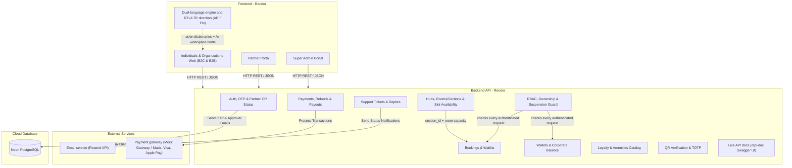

# System Architecture — Coworking Pass

This document describes the platform's technical architecture, the data flow between components, and the technologies used in development and production.

## 1. Tech Stack
- **Frontend:** a **Next.js 16** application (App Router, Turbopack) with **React 19**, **TypeScript**, **Tailwind CSS 4** and Lucide icons, using the **Tajawal** font through `next/font` for Arabic text.
- **Backend API:** routes built with **Next.js Route Handlers** (`app/api/**/route.ts`) on Node.js with TypeScript, talking to the database through Prisma. (There is no separate Express server.)
- **Hosting:** both the frontend and the backend are hosted on **Render** as cloud web services.
- **Database:** **Neon PostgreSQL** — a serverless cloud relational database suited to financial and booking systems.
- **ORM:** Prisma ORM v6 for database access and programmatic migrations.
- **Authentication and security:** JWT (JSON Web Tokens) valid for 24 hours with a revocation list on logout and a database ban check on every request, password hashing with bcryptjs, role-based access control (RBAC), one-time dynamic code verification (TOTP), and an international country-code picker with a standard phone-validation library (E.164 format) instead of a fixed Saudi regular expression.
- **Transactional email:** the **Resend API** for one-time verification codes (OTP), booking confirmation notifications, and partner approval or rejection notices (CR verification).
- **Internationalization (i18n):** JSON translation dictionaries (`ar` / `en`) with a strict type, a language provider (`I18nProvider`) and a system-message layer; see section 5.
- **Open API documentation:** full interactive OpenAPI 3.0 documentation through **Swagger UI** at `/api-doc`.

---

## 2. Architecture Diagram

```mermaid
graph TD
    %% User Interfaces
    subgraph Frontend [Frontend - Render]
        UI_User["Individuals & Organizations Web (B2C & B2B)"]
        UI_Partner["Partner Portal"]
        UI_Admin["Super Admin Portal"]
        UI_I18n["Dual-language engine and RTL/LTR direction (AR / EN)"]
    end

    %% Backend Services
    subgraph Backend [Backend API - Render]
        API_Auth["Auth, OTP & Partner CR Status"]
        API_Booking["Bookings & Waitlist"]
        API_Wallet["Wallets & Corporate Balance"]
        API_Billing["Payments, Refunds & Payouts"]
        API_Tickets["Support Tickets & Replies"]
        API_Loyalty["Loyalty & Amenities Catalog"]
        API_Hub["Hubs, Rooms/Sections & Slot Availability"]
        API_Guard["RBAC, Ownership & Suspension Guard"]
        API_QR["QR Verification & TOTP"]
        API_Docs["Live API docs (/api-doc Swagger UI)"]
    end

    %% External Services
    subgraph Third_Party [External Services]
        Ext_Payment["Payment gateway (Mock Gateway / Mada, Visa, Apple Pay)"]
        Ext_Email["Email service (Resend API)"]
    end

    %% Database
    subgraph Database [Cloud Database]
        DB[("Neon PostgreSQL")]
    end

    %% Connections
    UI_User -->|HTTP REST / JSON| Backend
    UI_Partner -->|HTTP REST / JSON| Backend
    UI_Admin -->|HTTP REST / JSON| Backend

    UI_I18n -.->|ar/en dictionaries + Ar workspace fields| UI_User
    API_Guard -->|checks every authenticated request| API_Booking
    API_Guard -->|checks every authenticated request| API_Wallet
    API_Hub -->|section_id + room capacity| API_Booking

    Backend -->|Prisma Client| DB

    API_Billing -->|Process Transactions| Ext_Payment
    API_Auth -->|Send OTP & Approval Emails| Ext_Email
    API_Tickets -->|Send Status Notifications| Ext_Email
```

---

## 3. Complex Flows

### A. Partner Commercial-Registration Verification Lifecycle
1. A new partner registers an account, chooses the partner role (Partner Admin), and enters the Saudi commercial registration number (CR Number / `taxNumber`).
2. The system creates the partner account with the initial status `PENDING_APPROVAL`.
3. If the partner tries to sign in before approval, the authentication gateway blocks access and returns `HTTP 403 Forbidden` with a message that the account is on hold pending administration review.
4. The new partner's request and commercial-registration data appear in the Super Admin dashboard.
5. The Super Admin verifies the registration:
   - **Approved:** the partner status becomes `APPROVED` and a welcome email is sent through **Resend**, telling them their account is active and that they can manage their venues and spaces and receive bookings.
   - **Rejected:** the status becomes `REJECTED`, and the partner is told the reason and asked to correct the documents.

### A-2. Hub → Rooms Model and Booking Flow
1. **Modeling:** `Workspace` (the hub) contains `WorkspaceSection` rooms with the fields `type`, `subType`, `capacity` and `hourlyRate` / `dailyRate` / `monthlyRate` / `yearlyRate`. The inventory is managed through `PUT /api/workspaces/:id/units` (update, create and delete within one transaction; a room that has bookings cannot be deleted), and `totalCapacity` is updated to the sum of the capacities.
2. **Selection:** the frontend queries `GET /api/workspaces/:id/units?date=`, which returns the rooms together with the sessions already booked for each room on that day. Choosing a room produces an "effective hub" (the room's type, capacity and rates) on which the available plans, price and session grid are built.
3. **Server validation at booking time**
   - `POST /api/hourly-bookings`: operating hours → fixed two-hour session ending by 10 PM at the latest → room capacity → no time overlap on the same `sectionId` (HTTP 409 on conflict). Hourly booking of individual desks is rejected.
   - `POST /api/direct-bookings`: room capacity in a multi-room hub (seats of overlapping confirmed bookings), otherwise the hub's capacity.
   - `GET /api/workspaces/:id/availability`: a pre-payment check that supports `sectionId`.
4. **Live capacity:** hall and theater bookings are not counted in the hub's daily occupancy; availability is evaluated per session and room so the whole day is never locked.
5. **Time storage:** booking times are stored as Riyadh time inside UTC fields (KSA wall-clock) to simplify comparisons.

### B. Digital Wallets and Refund Flow (Wallets & Refunds)
1. **Personal wallet (B2C):** the user can top up in advance and pay with one click.
2. **Shared corporate wallet (B2B):** the HR administrator tops up the unified company balance (`Company.balance`), which lets the affiliated employees book directly with an instant deduction from the company balance.
   - **Financial integrity:** wallet deductions (`/api/wallet` and `/api/companies/:id/withdraw`) use an atomic conditional update `balance >= amount` inside a transaction, with an advisory lock on the `referenceId` key to prevent duplicate deductions. Every movement is recorded in the wallet ledger (`WALLET_TRANSACTIONS` or `COMPANY_WALLET_TRANSACTIONS`) with `balance_after`.
   - **Cart rollback:** each booking in the cart carries its share of the deduction. If the server rejects a booking after the deduction, its share is returned automatically to the same wallet with a derived refund key (idempotent), without affecting the other bookings.
   - **Mixed cart:** each item is saved according to its own plan (hourly through `hourly-bookings`, or daily/monthly/yearly through `direct-bookings`), regardless of the hub's default mode.
3. **Automated cancellation and refund engine (Direct Bookings vs Packages):**
   - **Direct bookings of desks and meeting rooms:** free cancellation with a full refund before the booking time (6 hours for individuals, 24 hours for organizations) to enable waitlist promotion.
   - **Universal Pass:** a full refund is available within **3 days (72 hours)** of purchase provided no visit was used (`visitsUsed == 0`), executed atomically in one transaction (cancel the subscription + `REFUND` entry + wallet entry) and rejecting repeats.
   - **Hourly packages:** unused hours return to the package credit when a session is cancelled in advance, with the option to refund the full package value within 3 days if its hours were not consumed.
   - **Refund payout methods**
     - **Digital wallet:** the amount is added immediately to the user's wallet with no delay, and a movement is recorded in the wallet ledger.
     - **Bank card:** a refund request goes to the payment gateway and takes 5 to 14 business days.

### C. Support Ticketing Lifecycle
1. A customer or HR administrator opens a new support ticket (`Ticket`) with a subject, description and category (general / complaint / refund / enterprise). The company is resolved on the server from the requester's record, not from a value sent by the browser.
2. The ticket is recorded as `OPEN` and immediately appears in the Super Admin dashboard, and every administrator receives an in-app notification (`SUPPORT_TICKET`).
3. The support team reviews the ticket, replies, and moves it to `IN_PROGRESS`.
4. Replies (`TicketReply`) are saved in the database and shown as a conversation, and the ticket owner receives a notification when support replies. An administrator may reply even after closure.
5. When the problem is solved and the customer is satisfied, the ticket status changes to `CLOSED`.

### D. QR Scanning and Security Verification (QR Check-in Flow)
1. The system creates a temporary, protected dynamic QR code based on TOTP, tied to the booking number or Universal Pass.
2. Reception staff scan the code with a tablet or phone.
3. The request goes to the verification endpoint in the backend:
   - **Valid:** the entry is recorded in the `QR_CHECK_INS` table, and hours are deducted if the booking is for a meeting room or theater.
   - **Invalid or expired:** entry is refused immediately and recorded as a `FRAUD_ATTEMPT` in the security logs.

### E. Account Suspension Flow
1. The administrator enables the ban (`isBanned = true`); it is stored in the database and the temporary ban cache is invalidated immediately.
2. On any authenticated request the server verifies the token and then the account status in the database; if the account is suspended it returns `HTTP 403` with the code `ACCOUNT_SUSPENDED`.
3. The frontend intercepts this code globally and shows a **non-dismissible** suspension modal that blocks further use.

---

## 4. Hosting and Data Localization (Hosting & Deployment)
* **Frontend and backend:** fully hosted on **Render** as unified cloud web services that combine the Next.js interfaces and the API servers for stable performance and easy management.
* **Database:** hosted on **Neon Tech** (serverless PostgreSQL) with automated backups, high performance and instant scalability.
* **Email API:** integrated with **Resend** to ensure immediate delivery of email without landing in the spam folder.
* **Deployment management (CI/CD):** automatic linking of the GitHub repository so updates are deployed once reviewed and confirmed stable.

---

## 5. Internationalization and RTL Architecture

| Layer | Implementation |
| :--- | :--- |
| **Dictionaries** | `frontend/i18n/en.json` and `ar.json`. The translation-key type is derived from the English dictionary, and a build-time check fails when a key is missing or extra in either file. |
| **Provider** | `I18nProvider` exposes `t`, `lang`, `dir`, `setLang`, `localizeTime`, `formatDate` and `translateMessage`. The default language is Arabic. |
| **Persistence without a flash** | The root layout reads the `cp_lang` cookie on the server and sets `<html lang dir>` from the first response. `localStorage` is the source of truth in the browser and is mirrored to the cookie. The `i18n/server.ts` helper serves server components, because the main i18n module is a client module. |
| **System messages** | A translation registry (exact-match strings plus regular-expression patterns) for notifications and API error messages, translated centrally through `showToast`. Messages that are not registered appear in English. |
| **Dynamic content** | Fields such as `nameAr` on `Workspace`, and the `useSpaceText()` helper that picks the version for the current language with a fallback to English; Arabic city names come from the cities table. No machine translation. |
| **RTL** | Tailwind logical properties (`ms-` / `me-` / `ps-` / `pe-` / `start-` / `end-`) and `rtl:` variants for offsets, CSS mirroring of directional Lucide icons, and email, phone and number fields that stay LTR. |

---

## 6. Security Layers
1. **Authentication:** a 24-hour JWT, a revocation list, and a database check of the ban (`isBanned`) and approval (`ApprovalStatus`) status.
2. **Authorization:** role checks on every route, and an ownership helper (`lib/ownership.ts`) that resolves a partner's spaces and scopes queries (payouts, rooms, booking lists).
3. **Hiding:** hidden spaces are withheld on the server from everyone except the Super Admin and the owner.
4. **Data integrity:** database transactions, advisory locks for idempotency keys, and organized cascading deletion (`lib/cascade-delete.ts`).
5. **Schema synchronization:** Prisma migration files plus `ensureDatabaseSchema` (safely adding columns with `IF NOT EXISTS`), called on sign-in; calling `/api/db-sync` after every deployment that adds columns is recommended.

---

## 7. Technical Notes and Recommendations Before the Investor Pitch
> These are architectural and documentation improvement recommendations; they do not indicate failures in the core flows.

### A. Security priorities (recommended to close before launch)
1. **Personal wallet route:** it currently accepts a self-initiated deposit or refund from the user into their own wallet without verifying a payment. Deposits must be tied to the payment gateway (a signed webhook), and `REFUND` operations restricted to internal server flows. The same applies to depositing into the company wallet.
2. **Dependencies:** the audit (`npm audit`) shows 8 vulnerabilities in the backend dependencies (7 high) that need triage and updating.
3. **Rate limiting:** extend the existing protection on the login route to the wallet, booking and ticket routes.
4. **Pagination:** the `GET` lists (bookings, payouts, payments) return all permitted records at once; add pagination as data grows.

### B. Architectural improvements
1. **A transactional checkout:** today the wallet is debited and then bookings are created in separate calls with a compensating rollback. A better design is a single endpoint `POST /api/checkout` that performs the deduction and the bookings in one transaction and returns the result of each item.
2. **A single source of truth for inventory:** some interface state is still kept in `localStorage` (custom spaces, types, photos) and merged with server data; remove the local state and make the server the only source.
3. **Split `store.tsx`:** the file is very large (thousands of lines); split it into modules (authentication, bookings, wallets, spaces) and use React Query or similar to manage server state.
4. **Migrations:** adopt `prisma migrate deploy` as an official CI/CD step and reduce reliance on runtime synchronization.
5. **Events and notifications:** move notifications to a job queue to avoid slowing the booking path at scale.
6. **Monitoring and tracing:** add structured logs, error tracking (for example Sentry) and booking and payment metrics.
7. **Automated tests:** verification is currently manual and through TypeScript; add unit tests for the sensitive logic (capacity, operating hours, wallets, refunds) and integration tests for the critical routes.

### C. Documentation improvements
1. **Bring Swagger up to date:** add the `units` and `availability` routes and the scoped payouts to the OpenAPI description.
2. **Sequence diagram:** draw the payment flow with the compensating rollback for the investor presentation.
3. **Arabic screenshots:** attach RTL screenshots for the marketing presentation.
4. **Success metrics:** connect the KPIs in the PRD to the live reports dashboard to present real figures.
